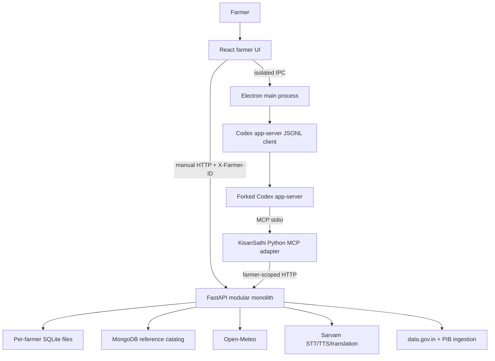
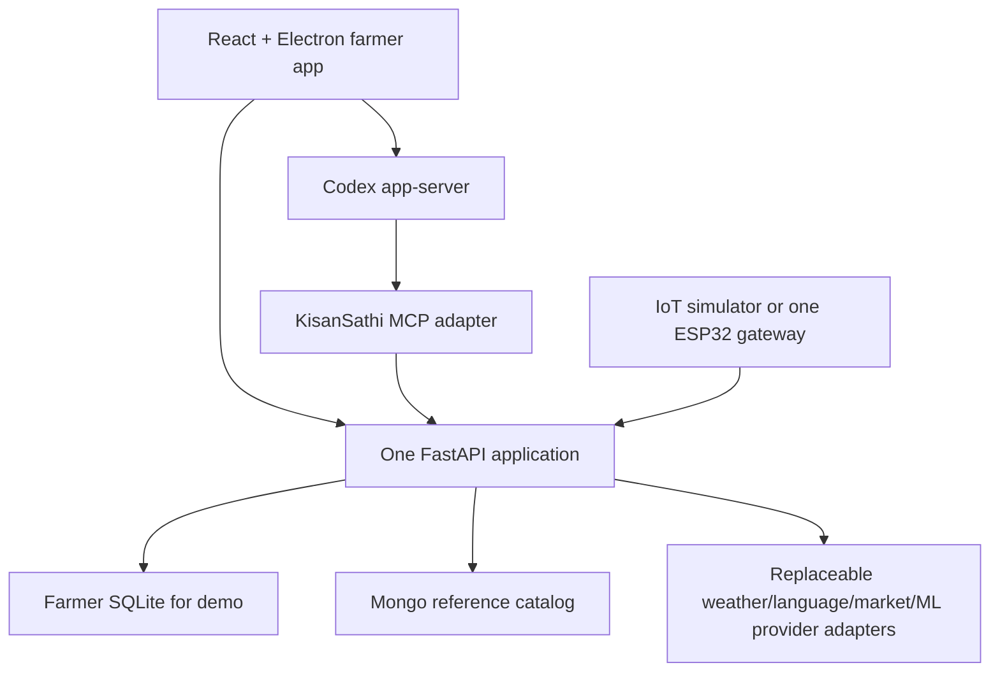
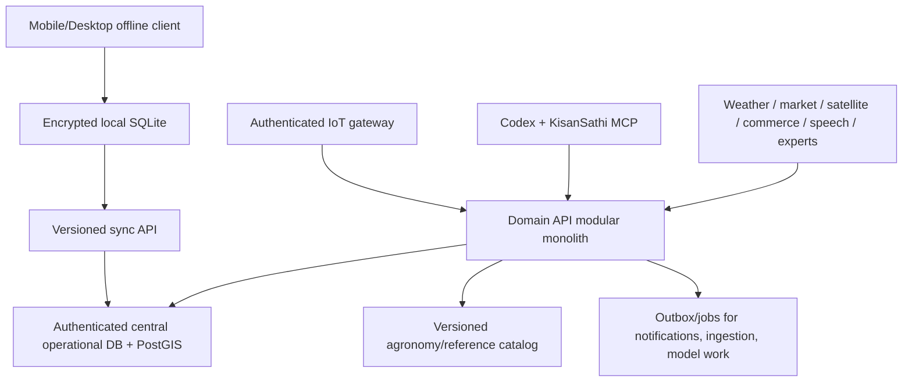
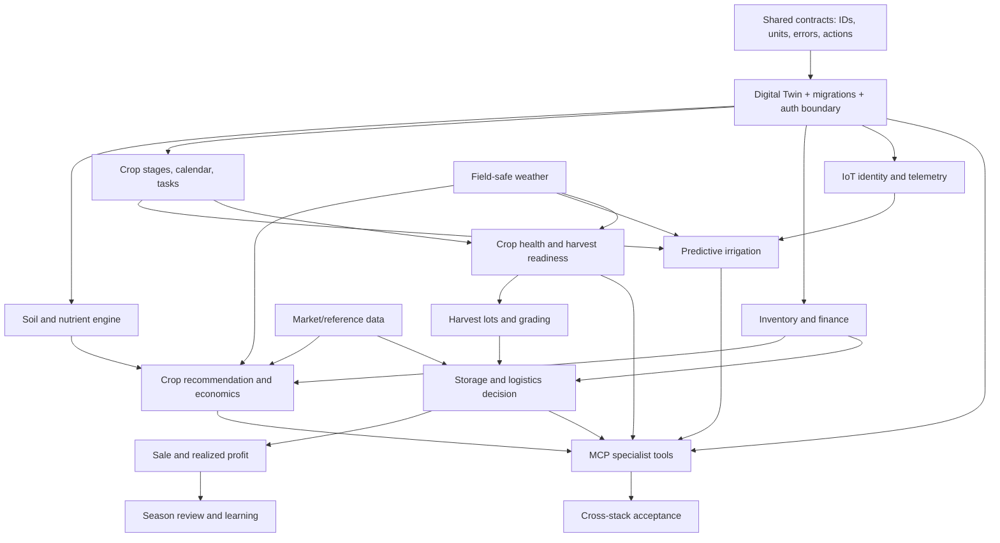

# Agentic Farm Operating System — Full Repository Audit and Implementation Plan

**Audit date:** 2026-08-20  
**Repository:** `C:\Users\prana\Desktop\sih mvp`  
**Audited revision:** `1001f9630b4aaed5a7ff244224e6778ed5dd6ea6` plus the complete dirty worktree  
**Audit rule:** Executable code and verified commands outrank README claims, plans, mock data, and comments.

# 1. Executive Summary

KisanSathi is already a credible multi-layer prototype. It is not merely a set of mock screens: the current worktree contains a React/Vite farmer application, an Electron desktop boundary, a Codex app-server client, a valid KisanSathi plugin, a Python MCP adapter with 47 registered tools, a FastAPI backend, per-farmer SQLite operational state, MongoDB reference catalogs, Open-Meteo weather, official market/MSP ingestion, and provider-gated Sarvam language/voice integration.

The working architecture is cleaner than the root README suggests. Farming logic is **not** implemented as native Rust handlers in `codex-core`. It remains in FastAPI and is exposed to Codex through `agent/src/kisansathi_agent/` and `codex/plugins/kisansathi/`. This preserves the upstream Codex tool and plugin seams and should remain the architectural direction.

The repository is nevertheless far from the complete farm-lifecycle vision. The current implementation is strongest in farmer profile/field state, basic soil and moisture recording, simple irrigation screening, weather, market reference data, multilingual conversation plumbing, and record-oriented MCP access. It is weakest in agronomic planning, real IoT, crop-health inference, inventory, finance persistence, harvest/post-harvest, logistics, storage decisions, production identity/security, offline synchronization, observability, and end-to-end testing.

The most important conclusion is that the next milestone should not add dozens of independent buttons or tools. It should establish a single shared Digital Twin and complete one evidence-backed lifecycle:

```text
Farmer → Farm → Field → Crop Cycle → Observation → Recommendation
       → Confirmed Action → Outcome → Economics → Season Learning
```

## Current maturity

| Area | Assessment |
|---|---|
| React farmer UI | Functional prototype; 17 routes, mostly backend-connected, very lightly tested |
| Electron/Codex desktop harness | Functional prototype with a narrow IPC boundary and JSONL lifecycle tests |
| KisanSathi MCP plugin | Functional local plugin; validator passes and real `tools/list` returns 47 tools |
| FastAPI farm state | Functional but incomplete; many useful entities, important transaction/unit/freshness defects |
| Reference catalog and ingestion | Functional prototype; Mongo-dependent, unbounded CRUD, no public-write authorization |
| Weather | Functional Open-Meteo adapter with caching and explicit unavailable behavior |
| Multilingual/voice | Translation/STT/TTS adapter exists, but requires Sarvam configuration and broader UX tests |
| Crop recommendation/economics | Not present beyond catalog filters and a simple explicit-input profit calculator |
| IoT | Data tables and manual HTTP ingestion only; no firmware, gateway, MQTT, device auth, or actuation |
| ML | No product model artifact or inference service; diagnosis is intentionally inconclusive |
| Harvest-to-sale lifecycle | Not present |
| Production readiness | Not ready: no production auth, CI, deployment, observability, offline sync, or full E2E proof |

## Immediate strategic recommendation

1. Stabilize and checkpoint the dirty worktree.
2. Freeze shared IDs, units, errors, action-safety levels, and Digital Twin contracts.
3. Split the monolithic backend router and MCP tool module before parallel feature development.
4. Complete one hackathon story using real stored data and explicit degraded states.
5. Add advanced lifecycle modules in dependency order; do not place farm business logic in `codex-core`.

# 2. Repository Map

```text
sih mvp/
├── src/                         React/Vite farmer application
│   ├── api/                     FastAPI browser clients
│   ├── components/              layout, map, chat, feedback states
│   ├── context/                 farm state and Codex conversation state
│   ├── pages/                   17 routed farmer screens
│   ├── features/financeStore.js browser-local finance ledger
│   ├── db/localDatabase.js      unused/competing IndexedDB prototype
│   └── i18n/                    English/Hindi/Marathi resources
├── desktop/                     Electron host, preload, Codex JSONL client
├── backend/
│   ├── app/
│   │   ├── farm_state/          per-farmer SQLite store and deterministic rules
│   │   ├── routers/             farm-state, reference, provider, ingestion APIs
│   │   ├── models/              Beanie/Mongo reference documents
│   │   ├── schemas/             Pydantic request/response models
│   │   ├── services/            weather, Sarvam, market, catalog ranking
│   │   └── scraping/            data.gov.in and PIB ingestion
│   ├── tests/                   14 current tests
│   ├── data/                    unignored runtime SQLite and uploaded image data
│   ├── n8n/                     reference-ingestion workflow
│   └── docker-compose.universal-data.yml
├── agent/
│   ├── src/kisansathi_agent/    Python MCP server/client/tools/result envelope
│   └── tests/                   10 current tests
├── codex/
│   ├── codex-rs/                large upstream Codex Rust workspace
│   └── plugins/kisansathi/      untracked local plugin package and launcher
├── tests/desktop/               6 Node JSONL/preload tests
├── .planning/                   GSD project state, roadmap, maps, research, notes
├── IMPLEMENTATION_AUDIT.md      prior narrower integration audit
├── MCP_AGENT_IMPLEMENTATION_PLAN.md
├── FRONTEND_BACKEND_MERGE_PLAN.md
├── CODEX_AI_HARNESS_MERGE_PLAN.md
└── package.json                 root UI/desktop build and test commands
```

## Major-directory status

| Directory | Purpose | Technology | Completion | Important entry points |
|---|---|---|---|---|
| `src/` | Manual farmer application | React 19, Vite 8, Tailwind 4, React Router, Leaflet, Recharts | Functional prototype | `src/main.jsx`, `src/routes/index.jsx` |
| `desktop/` | Secure local desktop and Codex bridge | Electron 43, Node CommonJS, JSONL | Functional prototype | `desktop/main.cjs`, `desktop/codex-harness.cjs` |
| `backend/app/` | Domain/data authority | Python 3.11+, FastAPI, Pydantic, SQLite, Beanie/Mongo | Functional but incomplete | `backend/app/main.py` |
| `agent/` | Farm MCP adapter | Python MCP/FastMCP, HTTPX | Functional prototype | `agent/src/kisansathi_agent/server.py` |
| `codex/plugins/kisansathi/` | Codex plugin packaging | plugin manifest, MCP stdio launcher, skill | Functional but untracked | `.codex-plugin/plugin.json`, `run_server.py` |
| `codex/codex-rs/` | General Codex harness | Rust workspace | Vendored/upstream capability; no farm handler fork detected | `cli/`, `app-server/`, `core/`, `codex-mcp/`, `core-plugins/` |
| `backend/tests/`, `agent/tests/`, `tests/desktop/` | Automated verification | pytest, node:test | Useful but narrow | test files listed in section 26 |

# 3. Current Architecture



## Verified request flow

- Manual UI calls go through `src/api/client.js`, `src/api/farmStateApi.js`, and `src/api/referenceApi.js` to routers registered in `backend/app/main.py`.
- Farmer operational state is selected by `X-Farmer-ID` in `backend/app/farm_state/dependencies.py` and stored by `FarmStateStore` in `backend/app/farm_state/store.py`.
- Conversational turns travel from `src/context/AIConversationContext.jsx` through the narrow preload contract in `desktop/preload.cjs` to `CodexHarness` in `desktop/codex-harness.cjs`.
- `CodexHarness.#spawnProcess()` launches `codex app-server --stdio` and injects the KisanSathi MCP command, backend URL, and launcher-owned farmer identity.
- `agent/src/kisansathi_agent/server.py::build_server()` registers 47 tools; `KisanSathiTools` calls FastAPI through `BackendClient`.
- Shared market/crop/seed/fertilizer/scheme/MSP/machinery data uses Beanie documents initialized in `backend/app/core/database.py`.
- Weather uses `backend/app/services/weather.py`; language and audio use `backend/app/services/sarvam.py` when configured.

## Architecture verdicts

| Decision | Verdict | Reason |
|---|---|---|
| Keep the LLM as orchestrator, not agronomy calculator | GOOD | Current MCP/backend split supports deterministic services and typed storage |
| Use an external KisanSathi MCP plugin rather than native Rust farm handlers | GOOD | Minimizes Codex fork divergence and reuses one backend contract |
| One FastAPI application for MVP domains/providers | GOOD | Avoids premature microservices |
| Mongo reference data + farmer SQLite operational data | ACCEPTABLE FOR LOCAL MVP | Ownership split is useful, but server-hosted SQLite is not true offline storage |
| Client-controlled `X-Farmer-ID` | ARCHITECTURAL RISK | Partition key, not authentication or authorization |
| Three competing local-state stores | NEEDS REFACTORING | SQLite, localStorage, and unused IndexedDB cannot form one Digital Twin |
| Physical actions enforced only through prompt/tool annotations | ARCHITECTURAL RISK | Future Level-3 actions need server/device enforcement and confirmation records |
| Monolithic `farm_state.py` and `tools.py` | NEEDS REFACTORING | Prevents safe parallel development and hides domain invariants |

## Codex fork findings

- The complete upstream Rust source is present under `codex/codex-rs/`.
- No KisanSathi-specific tracked modification was found in Codex core/tool handlers. `git diff -- codex` showed only the untracked `codex/plugins/` tree.
- Current farm integration relies on existing app-server, MCP, plugin, approval, and persistence capabilities. This is preferable to implementing `codex-rs/core/src/tools/handlers/kisansathi/`.
- The root `README.md` instruction to create native Rust KisanSathi handlers is architecturally obsolete and should be replaced.

# 4. Build / Runtime Status

## Commands run during this audit

| Command | Result | Evidence / warning | Interpretation |
|---|---|---|---|
| `npm run lint` | PASS | Exit 0 | Current JS/JSX lint scope passes; `.cjs` is not covered by ESLint |
| `npm run test:ui` | PASS | 1 file, 1 test | UI coverage is far too small for 17 routes |
| `npm run test:desktop` | PASS | 6/6 tests | JSONL lifecycle and preload boundary are covered with fakes |
| `npm run build` | PASS WITH WARNING | 639.50 kB minified main chunk | Functionally buildable; route/code splitting is required |
| `python -m pytest -q` in `backend/` | PASS WITH WARNING | 14 passed; Starlette/httpx deprecation | Backend behavior tested narrowly; dev dependencies are undeclared |
| `python -m pytest -q` in `agent/` | PASS WITH WARNING | 10 passed; Pydantic Settings forward-ref warning | Selected MCP contracts pass; most tools remain untested |
| plugin validator script | PASS | `Plugin validation passed` | Manifest/skill/MCP paths are structurally valid |
| MCP stdio `initialize` + `tools/list` | PASS WITH WARNING | 47 tools returned; same Pydantic warning | Real FastMCP framing works without needing the backend for list |

## Not verified

- Full Rust Codex workspace compilation/test suite: **NOT VERIFIED**. No farm-specific Rust source change was found, and this Windows host may require MSVC `link.exe`.
- A real signed-in Codex model turn invoking KisanSathi against a live backend: **NOT VERIFIED**.
- Live MongoDB reference CRUD and ingestion: **NOT VERIFIED** in this audit; current tests use parsing/fakes and startup can degrade.
- Live Sarvam STT/TTS/translation: **NOT VERIFIED** because credentials/provider availability were not assumed.
- Live data.gov.in/PIB ingestion: **NOT VERIFIED** because it depends on network/provider behavior.
- Packaged Electron installer/signing: **NOT PRESENT**.

## Git/workspace status

- Branch: `pranav`; current commit `1001f963...`.
- `aman`, `backend`, and `prachi` are ancestors of current `HEAD`.
- Worktree at audit time: 38 modified and 46 untracked entries after documentation-map refresh.
- Major application/plugin work is uncommitted. Before implementation, create a recoverable checkpoint without destructive Git commands.

# 5. Feature Inventory

Status vocabulary: `COMPLETE`, `FUNCTIONAL BUT INCOMPLETE`, `PROTOTYPE`, `MOCK`, `HARDCODED`, `PARTIAL`, `BROKEN`, `NOT PRESENT`, `DEPRECATED`.

| Module | Status | Existing evidence | Working? | Major problems | Priority |
|---|---|---|---|---|---|
| Farmer profile/settings | FUNCTIONAL BUT INCOMPLETE | `farm_state.py`, `store.py`, `Settings.jsx` | Local CRUD works | No login, consent, roles, recovery, verified identity | P0 |
| Farms | NOT PRESENT | Fields exist but no first-class farm entity | No | Field attaches directly to farmer DB | P0 |
| Fields/Digital Twin core | FUNCTIONAL BUT INCOMPLETE | `fields`, `crop_cycles`, soil, sensor, alerts, reports tables | Yes | Missing most lifecycle/economic entities and versioned state | P0 |
| GPS field mapping | PROTOTYPE | `LocationPicker.jsx`, `/v1/fields/map` | Approximate | Point-buffer polygon, weak validation, no drawn/surveyed boundary | P1 |
| Satellite/NDVI | NOT PRESENT | No provider/client/model artifacts | No | No abstraction, imagery, cloud masks, indices, overlays | P3 |
| Onboarding | PARTIAL | `Settings.jsx`, `MyFields.jsx` | Manual profile/field entry | Missing irrigation source, budget, risk, equipment, history | P1 |
| Multilingual UI | FUNCTIONAL BUT INCOMPLETE | i18next plus several parallel translation maps | Mostly | Multiple sources of truth; route-wide parity untested | P1 |
| Voice/STT/TTS/translation | PROTOTYPE | Sarvam service/routes; conversation integration | Provider-gated | No live proof, privacy/retention policy, weak full-flow tests | P1 |
| Codex desktop harness | FUNCTIONAL BUT INCOMPLETE | `desktop/codex-harness.cjs` | JSONL tests pass | Depends on installed/signed-in Codex; real E2E absent | P0 |
| KisanSathi MCP plugin | FUNCTIONAL BUT INCOMPLETE | 47 registrations, valid plugin, stdio list pass | Yes | Large catalog, partial tests, plugin untracked | P0 |
| Crop catalog | FUNCTIONAL BUT INCOMPLETE | Mongo `Crop`, crop CRUD/tools | Yes with Mongo | Public writes, unbounded lists, not decision logic | P1 |
| Crop recommendation | NOT PRESENT | No scoring/optimizer service | No | Catalog listing is not recommendation | P1 |
| Profitability/scenarios | PROTOTYPE | `calculate_profit`, market net-realisation | Basic math | No cost model, yield model, ROI/break-even/scenarios | P1 |
| Seed recommendation | PROTOTYPE | `MongoSeedMutator` | Catalog ranking | Falls back to all seeds; no sowing window/cost/availability trust | P1 |
| Soil tests | FUNCTIONAL BUT INCOMPLETE | SQLite schema/routes/UI/tools | Yes | Units not standardized; limited interpretation | P0 |
| Sensor observations | FUNCTIONAL BUT INCOMPLETE | tables, manual HTTP route, MCP write | Yes manually | Sensor-only NPK/pH excluded from interpretation; no device protocol | P0 |
| Nutrient deficit/dose | NOT PRESENT | Only pH/N threshold checks | No | No N-P-K deficit, product composition, area/stage/rain schedule | P1 |
| Fertilizer recommendation | PROTOTYPE | catalog filter/sort | Yes with Mongo | Does not calculate required dose or nutrient correction | P1 |
| Weather | FUNCTIONAL BUT INCOMPLETE | Open-Meteo adapter/cache/UI/tools | Yes/provider-dependent | Cross-field irrigation cache bug; freshness inconsistency | P0 |
| Crop calendar/stage | PARTIAL | cycles and free-text stage events | Manual history | No stage enum, automatic progression, stage requirements | P1 |
| Tasks/action engine | MOCK/PARTIAL | `field_tasks` table only; reminders work | Reminders only | No task CRUD/generation/completion/missed-task history | P1 |
| Irrigation advice | PROTOTYPE | `irrigation_rule()` | Read-only screening | Threshold logic, unit issues, wrong-field weather possibility | P1 |
| IoT telemetry | PARTIAL | device/reading tables | Manual API only | No firmware, gateway, MQTT, device auth, sequence/ack/offline queue | P1 |
| Pump/smart-plug control | NOT PRESENT | Explicitly excluded from tools | No | Safety architecture required before implementation | P2 |
| Crop disease diagnosis | MOCK | upload/persistence; provider-unavailable result | Upload works | No product model/provider diagnosis | P1 |
| Pest detection | NOT PRESENT | Disease reference catalog only | No | No model, symptoms fusion, outbreak feed | P2 |
| Expert escalation | NOT PRESENT | No KVK/agronomist workflow | No | Needed for low confidence/high-risk advice | P1 |
| Disaster warning | PARTIAL | simple weather alerts | Basic rain alerts | No multi-hazard before/during/after workflow | P2 |
| Machinery discovery | PROTOTYPE | Mongo catalog/API/UI/tool | Catalog works | No provider aggregation, quotes, effective-cost rank, booking | P1 |
| Seed/input procurement | NOT PRESENT | Catalogs only | No | No vendor adapters, availability, quotes, orders | P2 |
| Inventory | NOT PRESENT | No operational tables/API/UI | No | Recommendations cannot account for owned inputs/equipment | P2 |
| Financial ledger | PROTOTYPE | browser `localStorage` ledger | Single browser | Not in Digital Twin; no consent/sync/audit/security | P2 |
| Government schemes | PROTOTYPE/BROKEN SEMANTICS | Mongo/API/UI/tool | Discovery works | “Eligibility” ignores supplied criteria | P1 |
| Credit/insurance | NOT PRESENT | No code | No | No eligibility, claims, document workflows | P3 |
| Harvest readiness | NOT PRESENT | Expected harvest date only | No | No maturity indicators, weather or image assessment | P2 |
| Produce grading | NOT PRESENT | No model/schema | No | No lot/image/grade workflow | P3 |
| Storage decision | NOT PRESENT | Market comparison only | No | No future price/storage/spoilage/financing calculation | P2 |
| Mandi intelligence | FUNCTIONAL BUT INCOMPLETE | price/MSP/summary/trend/compare | Yes with data | Stale duplicates, flat default costs, exact-name joins | P1 |
| Price forecasting | NOT PRESENT | Trend is historical summary | No | No dataset, baseline, horizon, evaluation, uncertainty | P2 |
| Logistics | NOT PRESENT | No provider/schema/tool | No | No capacity, quote, route, spoilage or total-cost rank | P2 |
| Harvest/sales records | NOT PRESENT | No operational entities | No | Cannot compute realized season profit | P2 |
| Traceability | NOT PRESENT | Some histories but no lot/event chain | No | No seed/input/harvest/storage/buyer lineage | P3 |
| Season learning | NOT PRESENT | Historical records not used in next recommendation | No | No outcome/lesson model or evaluation loop | P3 |
| Offline-first sync | NOT PRESENT | Unused IndexedDB prototype | No | No queue, revisions, conflict rules, cache versions | P2 |
| Notifications | PARTIAL | alerts and delivery table | In-app only | No SMS/push/WhatsApp delivery adapter | P2 |
| Observability/audit | PARTIAL | framework logs, request IDs, ingestion runs | Minimal | No trace propagation, metrics, decision/action audit | P0 |
| Production auth/security | NOT PRESENT | Development header partitioning only | No | Spoofable identity, public catalog mutations, wildcard CORS | P0 |
| Deployment/CI | NOT PRESENT | local scripts/partial compose only | Manual | No app Dockerfile, CI, release packaging, readiness gate | P0 |

# 6. Existing Farming Tools

`agent/src/kisansathi_agent/server.py::build_server()` currently registers exactly 47 tools. A real MCP `tools/list` exchange verified the catalog.

## Read-only/recommendation tools

| Group | Tools | Current backing |
|---|---|---|
| Farm context | `get_farm_overview`, `get_profile`, `list_fields`, `get_farm_map`, `get_field`, `get_field_timeline` | Farmer SQLite/FastAPI |
| Soil/weather/irrigation | `get_soil_health`, `get_latest_field_observations`, `get_weather_for_field`, `get_weather_alerts_for_field`, `get_irrigation_advice` | SQLite + Open-Meteo + deterministic rules |
| Alerts/reminders/reports | `list_alerts`, `list_reminders`, `list_reports`, `get_report` | Farmer SQLite |
| Market/MSP | `get_market_summary`, `get_market_trend`, `get_market_history`, `compare_mandis`, `get_msp` | Mongo reference catalog + net-realisation formula |
| Reference/catalog | `find_government_schemes`, `list_government_schemes`, `list_crops`, `get_crop`, `recommend_seeds`, `recommend_fertilizers`, `check_scheme_eligibility`, `list_machinery_rentals` | Mongo and simple filters/sorts |
| Finance calculation | `calculate_profit` | Ephemeral explicit-input arithmetic |

## State-changing/provider tools

| Group | Tools | Current action |
|---|---|---|
| Farm state | `update_field`, `update_profile`, `create_field`, `start_crop_cycle`, `update_crop_stage`, `record_soil_test`, `record_sensor_reading` | Persist SQLite state |
| Operations | `record_irrigation_event`, `create_reminder`, `create_report`, `update_alert_status` | Persist history/reminders/reports/status |
| Deprecated advisor | `create_advisor_session`, `ask_farm_advisor` | Writes deprecated backend advisor records; returns unavailable provider response |
| Media/language | `diagnose_crop`, `send_voice_turn`, `transcribe_audio`, `synthesize_speech`, `translate_text` | Upload/provider calls; configured services only |

## Tool architecture findings

- Farmer identity is correctly omitted from model-visible arguments and bound in `Settings.from_env()`.
- `BackendClient` adds `X-Farmer-ID`, `X-Request-ID`, and idempotency headers.
- Results use `status`, `summary`, `data`, `source`, `warnings`, optional `request_id`, `freshness`, and `action` in `agent/src/kisansathi_agent/result.py`.
- All persistent/provider tools are currently annotated `_WRITE`, including translation/STT/TTS. This is conservative, but action levels should distinguish external processing from durable mutation.
- Registered tools significantly outnumber contract tests. A generated tool-contract matrix is required.
- `create_advisor_session` and `ask_farm_advisor` target backend routes marked `deprecated=True`; the Codex desktop harness should be the only reasoning loop.

# 7. Database Audit

## Current central reference store

MongoDB/Beanie documents registered in `backend/app/core/database.py`:

`Farmer`, `Crop`, `Disease`, `Fertilizer`, `MarketPrice`, `GovScheme`, `MSP`, `Seed`, `IngestionRun`, and `MachineryRental`.

Strengths:

- Clean reference/operational ownership concept.
- Official-source provenance fields exist in newer market/MSP work.
- Backend can remain available in degraded mode when MongoDB is down.

Defects:

- Most list queries use unbounded `.to_list()` and lack cursor pagination.
- Public CRUD mutation routes have no authentication or roles.
- Crop/market/fertilizer/seed names are free text across stores; no stable reference ID contract.
- Mongo `Farmer` and SQLite `profile` create ambiguous duplicate identity domains.
- Indexing and live database integration tests are incomplete.

## Current farmer SQLite store

`backend/app/farm_state/store.py::SCHEMA` creates:

`profile`, `preferences`, `fields`, `crop_cycles`, `crop_stage_events`, `field_tasks`, `soil_tests`, `sensor_devices`, `sensor_readings`, `field_observations`, `irrigation_plans`, `irrigation_events`, `reminders`, `weather_snapshots`, `weather_alerts`, `diagnosis_requests`, `diagnoses`, `diagnosis_images`, `disease_events`, `advisor_sessions`, `advisor_messages`, `recommendations`, `alerts`, `notification_deliveries`, `reports`, `report_jobs`, and `idempotency_records`.

Strengths:

- Per-farmer file isolation and foreign keys.
- Useful immutable history entities.
- Explicit provenance/freshness fields in many records.
- Idempotency records exist and sequential replay is tested.

Defects:

- This is server-local SQLite, not farmer-device offline SQLite.
- Schema initialization is a monolithic bootstrap, not a real migration system.
- A new connection executes the schema on each request.
- Multi-step mutations and idempotency records commit separately; crash/concurrency atomicity is not guaranteed.
- Measurement units are weak/free-text and rule calculations assume undocumented units.
- `field_tasks`, `sensor_devices`, several diagnosis/history tables, and `irrigation_plans` lack complete public workflows.
- Runtime files under `backend/data/farm_state/` and `backend/data/farm_uploads/` are not ignored by `.gitignore`.

## Competing browser stores

- `src/features/financeStore.js` persists finance in farmer-keyed `localStorage`.
- `src/db/localDatabase.js` defines IndexedDB stores for finance, soil, weather, and offline AI and seeds invented demo records, but is not used by the application API path.
- These are not synchronized with SQLite and must not be represented as one Digital Twin.

# 8. Backend Audit

FastAPI currently exposes **61 OpenAPI paths**. The farm-state slice is functional and includes profile, fields/map, crop cycles/stages, soil, observations, irrigation advice/events, reminders, alerts/dashboard, reports, diagnosis upload, weather, voice/translation, and deprecated advisor endpoints. Shared reference routers expose crop, disease, fertilizer, seed, scheme, machinery, market price, MSP, and ingestion operations.

## Reusable backend components

- `FarmStateStore` repository mechanics and safe farmer-key validation.
- Pydantic farm-state DTOs and explicit provider-unavailable states.
- `irrigation_rule()` as a clearly labeled screening baseline, not as final agronomy.
- Open-Meteo normalization/caching.
- Sarvam adapter boundaries.
- Market net-realisation formula.
- Official-data ingestion source adapters and `IngestionRun` audit records.

## Verified defects

1. **Cross-field weather bug:** irrigation reads the latest weather snapshot without field/location filtering.
2. **Sensor interpretation bug:** latest sensor NPK/pH values are returned as observations but soil interpretation uses only the latest `soil_tests` row.
3. **Unit-unsound rules:** moisture and nitrogen comparisons accept arbitrary units but compare raw numbers to fixed thresholds.
4. **Free-text crop stages:** stage-specific behavior can silently fail on capitalization, localization, or spelling.
5. **False scheme eligibility semantics:** `eligibility_criteria` is ignored by `MongoGovSchemeMutator`.
6. **Mandi ranking freshness:** comparison can rank multiple historical rows from the same mandi and uses flat default costs.
7. **Public destructive reference CRUD:** no auth/role checks.
8. **Wildcard CORS with credentials:** unsafe for deployment.
9. **Non-atomic idempotency:** protected mutation and replay record are separate commits.
10. **Monolithic routers:** `farm_state.py` and `assistants.py` combine unrelated bounded contexts.

# 9. Frontend Audit

## Screen inventory

| Screen | Route | Current status | Backend connected? | Mock/local data? | Required changes |
|---|---|---|---|---|---|
| Dashboard | `/` | Functional prototype | Yes, multiple endpoints | Images/presentation only | Per-card error/freshness states; tests; no silent partial failure |
| Fields | `/fields` | Functional prototype | Yes | Static images | Real boundary editor, edit/deactivate flows, validation |
| Field detail | `/fields/:fieldId` | Functional prototype | Yes | No core mock | Unknown-ID state, task/calendar/actions, tests |
| Farm map | `/map` | Prototype | Yes | OSM tiles | Survey/draw polygons, area calculation, satellite abstraction |
| Crop guide | `/crop-guide` | Partial | Yes, timeline only | No agronomy engine | Stage enum, stage plan, tasks, recommendation evidence |
| Soil health | `/soil` | Functional but incomplete | Yes | No | Units/trends/calibration, nutrient deficit, sensor interpretation fix |
| Weather | `/weather` | Functional prototype | Yes | Provider fixture possible | Field-safe freshness, forecast action links, offline cache |
| Irrigation | `/irrigation` | Prototype | Yes | Fixed rule | Predictive water balance, decision version, confirmation/action separation |
| Pest & disease | `/pest` | Mock capability | Upload endpoint | Provider unavailable | Real evaluated model/provider and expert escalation |
| Market | `/market` | Functional but incomplete | Yes | Depends on catalog | Latest-per-mandi, total-cost assumptions, source/freshness filters |
| Schemes | `/schemes` | Prototype | Yes | No | Correct eligibility evaluator and application boundary |
| Finance | `/finance` | Prototype | Market compare only | Browser localStorage ledger | Move to consented Digital Twin or clearly isolate local-only state |
| Machinery | `/machinery` | Prototype catalog | Yes | Static images; dead hosted mock service elsewhere | Provider adapters, quote/effective-cost flow, no false booking |
| AI assistant | `/ai` | Functional desktop prototype | Via Electron/Codex | Browser fallback limited | Real full-stack E2E, citation/provenance render, recovery tests |
| Voice assistant | `/voice` | Provider-gated prototype | Via Electron/backend | No canned success | Privacy, duration/codec checks, live/provider tests |
| Reports | `/reports` | Partial | Yes | Snapshot artifact | Real report definitions/export, lifecycle/economic content |
| Settings | `/settings` | Functional prototype | Yes | Demo identity | Onboarding expansion, consent, account/auth, notification channels |

## Frontend technical debt

- Only `ConversationView.test.jsx` exists for the entire React surface.
- Major JSX files contain multi-thousand-character lines, making reviews and parallel merges unsafe.
- Route modules are eagerly imported; Vite emits a 639.50 kB main chunk.
- Localization is split across i18next JSON, `translations.js`, `pageTranslations.js`, localized content, and page-local objects.
- No catch-all/404 route exists.
- `src/services/hostedCatalogService.js` exports hardcoded catalogs and is not imported by current screens.
- Old `src/data/dashboard.js`, `fields.js`, `chat.js`, and some localized fixtures appear unused and should be verified then removed or moved to explicit test fixtures.

# 10. ML Audit

## Product model inventory

| Model | Purpose | Path | Framework | Dataset/training | Inference | Metrics | Readiness |
|---|---|---|---|---|---|---|---|
| Crop recommendation | Rank crops | NOT PRESENT | — | — | — | — | NOT PRESENT |
| Yield prediction | Economics input | NOT PRESENT | — | — | — | — | NOT PRESENT |
| Price forecasting | Storage/market decision | NOT PRESENT | — | — | — | — | NOT PRESENT |
| Disease diagnosis | Image diagnosis | NOT PRESENT | — | — | Provider placeholder only | — | MOCK |
| Pest detection | Image/symptom diagnosis | NOT PRESENT | — | — | — | — | NOT PRESENT |
| Produce grading | Post-harvest grade | NOT PRESENT | — | — | — | — | NOT PRESENT |
| Harvest readiness | Maturity estimate | NOT PRESENT | — | — | — | — | NOT PRESENT |
| Disaster risk | Hazard risk | NOT PRESENT | — | — | — | — | NOT PRESENT |
| Satellite crop health | NDVI/anomaly | NOT PRESENT | — | — | — | — | NOT PRESENT |

The only notebook found is `codex/sdk/python/notebooks/sdk_walkthrough.ipynb`, which belongs to the upstream Codex SDK and is unrelated to agriculture. The product therefore has **no trained, evaluated, deployed ML artifact**.

Use deterministic formulas/rules for nutrient balance, crop calendars, net realization, and irrigation water balance. Add ML only where prediction adds measurable value, and every model response must include `prediction`, `confidence`, `model_version`, `warnings`, and an abstention/escalation path.

# 11. IoT Audit

## Current reality

- `sensor_devices` and `sensor_readings` tables exist in `FarmStateStore`.
- `POST /v1/sensor-readings` and MCP `record_sensor_reading` can insert a manually supplied reading.
- A low raw moisture value can create a deduplicated alert.
- No firmware (`.ino`, MCU C/C++), MQTT client/broker, device-registration endpoint, device key, sequence number, calibration workflow, gateway, command queue, acknowledgement, relay, smart plug, or pump controller exists.
- The backend `websockets` dependency does not constitute an IoT transport implementation.

## Required device architecture


## Minimum telemetry contract

```json
{
  "device_id": "dev_...",
  "sensor_id": "sns_...",
  "field_id": "fld_...",
  "sequence": 1842,
  "observed_at": "2026-08-20T00:00:00Z",
  "measurement": "soil_moisture_volumetric",
  "value": 0.24,
  "unit": "m3/m3",
  "calibration_version": "cal-3",
  "battery_percent": 71,
  "signature": "..."
}
```

Required behaviors: device-scoped credentials, monotonic sequence/deduplication, clock-skew handling, explicit units, calibration version, offline buffering, retry with backoff, last-seen state, health alerts, key rotation, and simulator tests.

## Physical-control safety

Pump control is **post-MVP** until these are implemented:

- Hardwired/manual override and electrical interlock.
- Maximum run time, dry-run/water-level protection, cooldown, and watchdog.
- Level-3 confirmation record bound to farmer, field, device, command payload, and expiry.
- Device acknowledgement plus observed flow/current feedback; never equate “command queued” with “pump started.”
- Idempotent command IDs, cancellation/emergency stop, and immutable audit history.

# 12. Digital Twin Audit

## Current Digital Twin coverage

```text
Farmer profile                 PRESENT
Farm                           MISSING
Fields + approximate GeoJSON   PRESENT / PROTOTYPE
Crop cycles + stage events     PRESENT / MANUAL
Soil tests                     PRESENT
Sensor readings                PRESENT / MANUAL INGESTION
Weather snapshots              PRESENT
Irrigation advice/history      PRESENT / BASIC
Tasks                          TABLE ONLY
Alerts/reminders               PRESENT
Diagnosis records/images       PRESENT / PROVIDER PLACEHOLDER
Recommendations               TABLE ONLY / NO UNIFIED ENGINE
Reports                        PRESENT / SNAPSHOT
Inventory/equipment            MISSING
Input applications             MISSING
Expenses/budgets               BROWSER-LOCAL ONLY
Harvest lots/grades/storage    MISSING
Logistics/sales                MISSING
Insurance/schemes/credit       MISSING OR REFERENCE-ONLY
Outcome/season learning        MISSING
```

The current SQLite slice is a useful foundation but not yet the shared state required by the product. The Digital Twin must become the canonical source for every specialist tool. It should store source observations and decisions separately, retain rule/model versions and assumptions, and link each recommendation to a confirmed action and result.

## Required event chain

```text
Observation
  → Context snapshot
  → Recommendation (rule/model version, confidence, sources)
  → Farmer decision
  → Confirmed action / rejected action
  → Execution evidence
  → Outcome
  → Economic result
  → Season lesson
```

# 13. Missing Features

## A. Already usable with limited modification

| Capability | Why reusable | Required hardening | Complexity |
|---|---|---|---|
| React shell and route structure | Complete farmer navigation surface | Format/split, lazy load, test states | M |
| Electron security boundary | Narrow preload contract and tests | Validate all IPC payloads, packaging | M |
| Codex JSONL client | Thread/turn/recovery/approval flow exists | Real app-server E2E and protocol pin | M |
| Python MCP boundary | Valid stdio server, 47 tools, bounded results | Split domains, contract matrix, action levels | M |
| FastAPI modular monolith | Clear composition and DTO patterns | Router decomposition, auth, transactions | L |
| SQLite farm-state history | Useful field/cycle/soil/observation foundation | Real migrations, units, UoW, sync design | L |
| Open-Meteo weather | Real provider and caching | Field-safe cache/freshness and adapters | S |
| Official market/MSP ingestion | Real parsers and provenance | Live integration tests, pagination, freshness | M |
| Sarvam boundary | STT/TTS/translation implemented | Live quality/privacy tests and fallback | M |

## B. Existing but requires substantial work

| Gap | Impact | Dependencies | Priority | Complexity |
|---|---|---|---|---|
| Production identity and authorization | Blocks safe multi-user use | deployment/session design | P0 | L |
| Digital Twin schema/migrations | Blocks all lifecycle integration | shared contracts | P0 | XL |
| Soil/nutrient units and calculations | Unsafe/weak recommendations | reference agronomy, units | P1 | L |
| Crop stage/calendar/tasks | Advice is not stage-aware/actionable | Digital Twin, crop references | P1 | L |
| Predictive irrigation | Current rule can mislead | weather fix, crop stage, soil profile, ET | P1 | L |
| Scheme eligibility | Current response overclaims | farmer context and rules | P1 | M |
| Market net realization | Rankings can be stale/duplicated | market freshness, logistics costs | P1 | M |
| Multilingual UX | Farmer accessibility | one i18n source, provider contract | P1 | M |
| Finance storage | Profit cannot close the lifecycle | consent/auth/Digital Twin | P2 | L |
| Farm map | Digital Twin geometry is approximate | geometry API/provider abstraction | P1 | L |

## C. Completely missing

| Feature | Impact | Dependencies | Priority | Complexity |
|---|---|---|---|---|
| Multi-signal crop recommendation and scenarios | Core pre-sowing decision absent | soil/weather/market/economics/rotation | P1 | XL |
| Inventory/equipment ownership | Recommendations cannot reuse owned assets | Digital Twin | P2 | L |
| Vendor/provider aggregation and quotes | No procurement completion | identity, geo, provider adapters | P2 | XL |
| Real IoT gateway/device auth | No hardware data trust | identity, telemetry contract | P1 | XL |
| Safe physical control | No automation | IoT + safety hardware + confirmations | P2 | XL |
| Evaluated crop-health engine | No real diagnosis | datasets/models/expert network | P1 | XL |
| Expert escalation | Unsafe low-confidence advice | identity, crop-health case workflow | P1 | M |
| Disaster before/during/after workflow | Incomplete resilience | weather/hazard providers/tasks | P2 | L |
| Harvest readiness/lots | Post-growing lifecycle missing | crop calendar/Digital Twin | P2 | L |
| Grading/storage/logistics/sales | No post-harvest optimization | harvest lots, providers, economics | P2/P3 | XL |
| Insurance/credit/application workflows | Financial ecosystem missing | auth, documents, Digital Twin | P3 | XL |
| Traceability and season learning | No closed learning loop | all lifecycle events/outcomes | P3 | XL |
| Offline sync | Weak rural connectivity support | client-owned store, revision protocol | P2 | XL |
| CI/deployment/observability | Cannot release reliably | stabilized repo/contracts | P0 | L |

# 14. Architectural Problems

## Critical defects and exact remediation

1. **Conflicting architectural documentation.** `README.md` instructs native Rust farm handlers; current code and `.planning/PROJECT.md` use MCP/FastAPI. Replace the README guidance and mark the native-handler plan deprecated.
2. **Backend ownership contradiction.** `backend/AGENTS.md` says per-farmer state must not live in FastAPI, while current implementation deliberately places `farm_state/` there. Update the instruction after deciding MVP versus production ownership.
3. **No authoritative local-state strategy.** Select one offline repository; remove or migrate browser `localStorage` and unused IndexedDB.
4. **Monolith collision points.** Split `backend/app/routers/farm_state.py`, `backend/app/routers/assistants.py`, and `agent/src/kisansathi_agent/tools.py` by domain before parallel work. Keep registration/composition owned by the integration agent.
5. **Business semantics hidden in endpoints and prompts.** Move stage, nutrient, irrigation, market, and safety rules into versioned domain services. The LLM explains and orchestrates only.
6. **Weak units and reference identity.** Introduce canonical measurement types, UCUM-like unit codes, stable crop/variety/product IDs, and conversions at ingestion boundaries.
7. **Non-atomic writes.** Add a transaction/unit-of-work API that includes action, side effects, and idempotency record.
8. **No migrations.** Replace `CREATE TABLE IF NOT EXISTS` bootstrap-as-migration with ordered migrations and upgrade tests.
9. **Unbounded external/model context.** Add API pagination/limits before MCP result bounding; model-side truncation alone is not enough.
10. **Action safety depends on prompts.** Enforce action levels and confirmation tokens server-side. Level 3 additionally requires device/service safety enforcement.
11. **Prototype tenant security.** Replace spoofable header identity for production; restrict reference writes and CORS immediately in deployable profiles.
12. **No decision provenance chain.** Persist inputs, rule/model version, sources, assumptions, confidence, farmer response, and outcome.
13. **No provider adapters for commerce/satellite/IoT.** Define ports first; keep provider-specific DTOs out of core domains.
14. **No cross-stack release gate.** Add CI and a real journey test across Electron → Codex → MCP → FastAPI → database.

## Reuse, deprecate, or delete

| Artifact | Decision | Reason |
|---|---|---|
| `codex/codex-rs/` upstream architecture | REUSE | Mature harness; minimize divergence |
| `agent/` MCP adapter | REUSE/REFACTOR | Correct boundary; split by domain |
| `backend/app/farm_state/` | REUSE/EVOLVE | Good MVP base; needs migrations/units/UoW |
| `README.md` native Rust Kisan handlers | DEPRECATE/REWRITE | Contradicts working plugin architecture |
| Deprecated advisor backend routes/tools | DEPRECATE THEN REMOVE | Duplicates Codex reasoning path |
| `src/db/localDatabase.js` | ADOPT AS REAL OFFLINE REPOSITORY OR DELETE | Current unused seeded prototype is misleading |
| `src/features/financeStore.js` | MIGRATE OR CLEARLY ISOLATE | Not part of Digital Twin |
| `src/services/hostedCatalogService.js` | DELETE AFTER IMPORT CHECK | Unused hardcoded demo catalog |
| Old unused `src/data/*` fixtures | MOVE TO TESTS OR DELETE | Avoid confusing mock data with live state |
| `backend/app/schemas/sensors.py` | DELETE/MERGE AFTER REFERENCE CHECK | Duplicates farm-state sensor DTO concept |
| Public reference DELETE/PUT/POST routes | RESTRICT OR REMOVE FROM PUBLIC API | Unsafe and not farmer-facing |
| Runtime `backend/data/*` | IGNORE/MOVE OUTSIDE REPO | Contains private SQLite/image data |

# 15. Target Architecture

## Hackathon/MVP architecture

Keep deployment simple:



Do not create separate microservices for every agricultural engine. Use domain modules inside FastAPI. A separate Python inference process is justified only for a heavy CV model or incompatible runtime.

## Production evolution



Mongo may remain as ingestion/reference staging during the MVP. A production operational sync store should support authenticated tenancy, transactions, geometry, revisions, and backups; PostgreSQL/PostGIS is a stronger fit than server-local SQLite. Avoid a risky immediate rewrite—introduce repository interfaces and migrate deliberately.

## Domain boundaries

- Identity & consent
- Farms/fields/Digital Twin
- Agronomy reference catalog
- Soil & nutrient planning
- Crop planning & economics
- Calendar/tasks/operations
- Weather/disaster
- IoT/irrigation
- Crop health/expert cases
- Inventory/procurement/equipment
- Harvest/quality/storage/logistics/market
- Finance/schemes/insurance
- Recommendations/actions/outcomes/traceability

# 16. Target Database Schema

## Shared identifiers and base fields

- IDs: opaque strings with typed prefixes backed by UUIDv7, e.g. `far_`, `farm_`, `fld_`, `cyc_`, `sns_`, `tsk_`.
- Every mutable entity: `created_at`, `updated_at`, `revision`, `deleted_at` where offline sync requires tombstones.
- Every observation: `observed_at`, `received_at`, `source`, `source_record_id`, `unit`, `quality_flag`, `confidence`.
- Every decision: `decision_version`, `input_snapshot`, `sources`, `assumptions`, `warnings`, `confidence`.

## Core relational entities

| Domain | Required entities | Key relationships |
|---|---|---|
| Identity | `users`, `farmer_profiles`, `devices`, `consents`, `farm_memberships` | user ↔ farmer ↔ farm role |
| Geography | `farms`, `fields`, `field_boundaries`, `field_zones`, `sensor_locations` | farm 1→N fields; GeoJSON API/PostGIS storage |
| Crop lifecycle | `crop_cycles`, `crop_stage_events`, `crop_plans`, `tasks`, `task_dependencies` | field 1→N cycles; cycle 1→N stages/tasks |
| Soil | `soil_samples`, `soil_measurements`, `soil_interpretations`, `nutrient_plans` | sample/reading tied to field and depth |
| IoT | `devices`, `sensors`, `sensor_calibrations`, `telemetry`, `device_commands`, `command_acknowledgements` | device/sensor/field identity and sequence |
| Operations | `irrigation_decisions`, `irrigation_events`, `input_applications`, `field_observations` | each action linked to recommendation/confirmation |
| Inventory | `inventory_items`, `inventory_lots`, `inventory_movements`, `equipment`, `maintenance_events` | owned quantity and lot history |
| Health | `crop_health_cases`, `case_images`, `model_inferences`, `symptoms`, `treatments`, `expert_referrals` | case tied to field/cycle and reviewed outcome |
| Disaster | `hazard_events`, `preparedness_plans`, `damage_assessments`, `recovery_actions`, `claim_evidence` | before/during/after event chain |
| Harvest | `harvest_lots`, `quality_assessments`, `grades`, `packaging_lots` | crop cycle 1→N harvest lots |
| Storage | `storage_facilities`, `storage_lots`, `storage_events`, `spoilage_observations` | harvest lot movement and losses |
| Commerce | `vendors`, `offers`, `quotes`, `bookings`, `transport_quotes`, `market_observations`, `sales` | normalized provider results and realized sale |
| Finance | `ledger_entries`, `budgets`, `cost_allocations`, `insurance_policies`, `scheme_matches`, `scheme_applications` | entries attributable to field/cycle/lot |
| Intelligence | `recommendations`, `actions`, `confirmations`, `outcomes`, `season_reviews`, `trace_events` | closed decision/audit/learning loop |
| Sync | `change_log`, `sync_cursors`, `conflicts`, `outbox` | offline queued writes and server reconciliation |

## Reference catalog requirements

Stable IDs for crops, varieties, crop stages, nutrient requirements, rotation rules, diseases, pests, treatments, products, fertilizer composition, machinery types, schemes, markets, and units. Farmer records store reference IDs plus a versioned snapshot of display-critical facts so history remains interpretable after catalog updates.

# 17. Target Tool Architecture

## Common result contract

Preserve the existing MCP envelope rather than replacing it. Extend compatibly:

```json
{
  "status": "ok|degraded|error",
  "summary": "human-readable bounded summary",
  "data": {},
  "source": "service name",
  "sources": [],
  "freshness": null,
  "confidence": null,
  "warnings": [],
  "recommendations": [],
  "requires_confirmation": false,
  "request_id": "...",
  "action": null,
  "schema_version": "1"
}
```

This is compatible with `agent/src/kisansathi_agent/result.py`; do not force every domain to fake a confidence value.

## Action safety levels

| Level | Meaning | Examples | Enforcement |
|---|---|---|---|
| 0 | Read-only facts | weather, soil history, market observations | automatic, scoped authorization |
| 1 | Recommendation | crop ranking, fertilizer plan, irrigation advice | show assumptions/confidence; no side effect |
| 2 | Application-state mutation | create task, record expense, acknowledge alert | explicit confirmation, idempotency, audit |
| 3 | External/physical/financial action | run pump, book machinery, place order, submit claim | short-lived server confirmation token plus provider/device safety controls |

## Proposed specialist tools

**Implementation and permission convention for every row below:** L0 and L1 tools are implemented as Python FastAPI domain services exposed through the Python MCP adapter and require authenticated `farm:read` or `farm:recommend` access to the referenced farm/field. L2 tools use the same implementation boundary but additionally require `farm:write`, an explicit farmer confirmation record, an idempotency key, and an audit entry. ML-backed L1 tools call a versioned Python inference/provider interface behind FastAPI. L3 tools require a separate provider/device gateway plus a short-lived `external:commit` or `device:control` authorization bound to the exact payload; the MCP adapter never executes hardware/provider protocols directly. Tool-specific dependencies and exceptions appear in the last column.

| Tool | Purpose | Inputs | Output | Data source | Side effect / level | Errors and dependencies |
|---|---|---|---|---|---|---|
| `get_farmer_context` | Canonical preferences/constraints | optional context depth | bounded farmer context | Digital Twin | L0 | auth, missing profile |
| `get_field_context` | Field/cycle current state | `field_id` | geometry, cycle, observations, warnings | Digital Twin | L0 | not found/forbidden |
| `recommend_crops` | Ranked next-crop scenarios | field, season, budget/risk overrides | ranked agronomy/economics scenarios | soil/weather/market/catalog/history | L1 | insufficient data, stale provider |
| `recommend_seed_varieties` | Variety decision | crop/field/cycle constraints | ranked varieties with reasons/cost | reference + vendor availability | L1 | no verified availability |
| `calculate_nutrient_plan` | Deficit and schedule | field/cycle, target yield | nutrient deficits, doses, timings | soil + crop requirements | L1 | units/calibration missing |
| `recommend_fertilizer_products` | Map deficit to products | nutrient plan, inventory, budget | product quantities/cost/options | catalog/inventory/vendors | L1 | unsafe/unsupported product |
| `get_crop_stage` | Determine current stage | `crop_cycle_id`, optional observation | stage, confidence, next window | calendar + observations | L0/L1 | ambiguous stage |
| `generate_crop_tasks` | Turn plan into tasks | cycle/plan ID | proposed task set | stage plan/weather | L1 until confirmed | conflicts/missing dates |
| `create_farm_tasks` | Persist selected tasks | task drafts, confirmation token | authoritative tasks | Digital Twin | L2 | confirmation/idempotency |
| `get_inventory` | Owned inputs/equipment | filters | quantities/lots/expiry | inventory store | L0 | stale count |
| `record_inventory_movement` | Receive/use/adjust stock | item/lot/quantity/reason | movement + balance | inventory store | L2 | negative stock/conflict |
| `search_input_quotes` | Aggregate seed/fertilizer/tool quotes | item/location/quantity/date | normalized ranked quotes | provider adapters | L0 | provider unavailable |
| `search_machinery_quotes` | Effective rental cost | machine/field/date/duration | price+delivery+fuel+operator ranking | providers/internal catalog | L0 | availability stale |
| `get_irrigation_recommendation` | Predictive water decision | field/cycle/time | need, volume, window, reason | sensors/weather/ET/history | L1 | stale sensor/forecast |
| `create_irrigation_task` | Schedule approved irrigation | decision ID/window | task record | operations store | L2 | confirmation/idempotency |
| `control_irrigation` | Send safe device command | decision/device/confirmation token | queued/acknowledged/result state | IoT gateway | L3 | interlock/offline/timeout/denied |
| `diagnose_crop_health` | Disease+pest triage | case/image/symptoms/field | candidates, confidence, urgency | evaluated model + context | L1 | low confidence → escalation |
| `request_expert_review` | Escalate a health case | case ID, consent, channel | referral/status | expert adapter | L2 | unavailable expert/privacy |
| `get_disaster_risk` | Multi-hazard risk | field/time horizon | hazards/probability/actions | weather/hazard providers | L1 | stale/unsupported region |
| `create_disaster_plan` | Persist preparedness tasks | hazard assessment | plan/tasks | Digital Twin | L2 | confirmation |
| `assess_harvest_readiness` | Harvest timing | crop cycle, observations/images | now/window/delay with reasons | stage/weather/quality model | L1 | insufficient maturity evidence |
| `create_harvest_lot` | Record harvest | cycle, quantity, time | lot and trace ID | Digital Twin | L2 | units/confirmation |
| `grade_produce` | Quality grade | harvest lot/images/measurements | grade, defects, model version | CV/manual grader | L1/L2 if persisted | abstention/model unavailable |
| `get_storage_recommendation` | Sell/store/other market | lot, offers, forecast, costs | scenario ranking | market/storage/spoilage/finance | L1 | uncertain price/spoilage |
| `search_storage_quotes` | Find warehouses/cold stores | lot/location/duration | normalized quotes | provider adapters | L0 | stale availability |
| `search_transport_quotes` | Effective logistics cost | lot/origin/destination/date | ranked quotes | logistics providers | L0 | capacity unavailable |
| `calculate_market_net_realization` | Compare selling outcomes | lot/market/transport/storage costs | net scenario results | market/logistics/finance | L1 | stale observations |
| `record_expense` | Persist farm cost | cycle/category/amount/evidence | ledger entry | finance store | L2 | auth/confirmation/duplicate |
| `record_sale` | Persist realized sale | harvest lot/buyer/price/costs | sale + profit update | commerce/finance | L2 | lot balance/conflict |
| `calculate_crop_profit` | Expected/actual economics | cycle/scenario | cost, revenue, profit, ROI, break-even | ledger/yield/market | L0/L1 | missing allocations |
| `search_government_schemes` | Contextual scheme discovery | planned action/farmer/region | matches and missing eligibility data | scheme rules + Digital Twin | L1 | not an approval decision |
| `prepare_insurance_claim` | Assemble claim evidence | hazard/cycle/damage/consent | document checklist/draft | Digital Twin + insurer adapter | L2, submission L3 | legal/consent/provider |
| `get_season_review` | Summarize outcome and lessons | crop cycle/season | agronomy/economic lessons | complete history | L0/L1 | incomplete outcome data |

# 18. Target API Contracts

## Shared rules

- Authentication: production `Authorization: Bearer <token>`; tenant/farmer derived from claims, never request body.
- Device ingestion: device credential/signature separate from farmer user auth.
- Correlation: `X-Request-ID`; all errors and actions return it.
- Writes: `Idempotency-Key` required for L2/L3 commands.
- Timestamps: RFC 3339 UTC on application APIs; store timezone separately only for display/scheduling.
- Geo: GeoJSON Polygon/MultiPolygon at API boundary; validate ring closure, orientation, self-intersection, and area.
- Pagination: cursor + limit, hard maximum; never unbounded lists.
- Retry: GET/HEAD safe with bounded exponential backoff; writes retry only with the same idempotency key; L3 commands expose state rather than blindly resend.

## Common error

```json
{
  "error": {
    "code": "stable_machine_code",
    "message": "safe user-facing message",
    "request_id": "...",
    "retryable": false,
    "details": {}
  }
}
```

## Major endpoint contracts

| Endpoint | Method | Request | Response | Auth | Timeout/retry |
|---|---|---|---|---|---|
| `/v1/me/context` | GET | depth flags | farmer/farm/preferences summary | user | 5s, retry GET |
| `/v1/farms` | GET/POST | cursor or farm create | farm page / farm record | user L0/L2 | 5s; write idempotent |
| `/v1/fields/{id}` | GET/PATCH | field patch with revision | field + GeoJSON + revision | membership | 5s; optimistic concurrency |
| `/v1/fields/{id}/context` | GET | include flags | bounded Digital Twin context | membership | 8s, retry GET |
| `/v1/crop-plans/recommend` | POST | field, season, constraints | ranked scenarios + assumptions | membership L1 | 15s, no blind provider retry |
| `/v1/crop-cycles` | POST | field/crop/variety/dates | authoritative cycle | membership L2 | idempotency required |
| `/v1/crop-cycles/{id}/stage` | GET/PATCH | observation or confirmed stage | stage assessment/event | membership L0/L2 | conflict on stale revision |
| `/v1/soil/measurements` | POST | typed measurements/units/source | stored sample/readings | membership/device L2 | validate/convert; idempotent |
| `/v1/soil/nutrient-plans` | POST | field/cycle/target yield | deficits/doses/schedule | membership L1 | 10s; versioned rules |
| `/v1/tasks` | GET/POST/PATCH | cursor/task/transition | task page/task event | membership L0/L2 | idempotent transitions |
| `/v1/weather/fields/{id}` | GET | horizon | normalized forecast/freshness | membership | 8s, cache/provider fallback |
| `/v1/hazards/fields/{id}` | GET | horizon | hazard assessments/actions | membership | 10s, explicit partial results |
| `/v1/iot/telemetry` | POST | signed batch/sequence | accepted/rejected/next sequence | device | 10s, batch idempotency |
| `/v1/irrigation/decisions` | POST | field/cycle/decision time | versioned recommendation | membership L1 | 10s |
| `/v1/device-commands` | POST | decision/device/confirmation | command state | user+device policy L3 | no blind retry; poll state |
| `/v1/crop-health/cases` | POST | field/cycle/symptoms | case | membership L2 | idempotent |
| `/v1/crop-health/cases/{id}/images` | POST | bounded media | image metadata/job | membership/consent | upload timeout, checksum dedupe |
| `/v1/crop-health/cases/{id}/assessment` | GET | — | inference/review/abstention | membership | 15s; job/poll for long inference |
| `/v1/inventory` | GET | filters/cursor | inventory page | membership | 5s |
| `/v1/inventory/movements` | POST | lot/quantity/unit/reason | movement/balance | membership L2 | idempotency + transaction |
| `/v1/quotes/search` | POST | category/location/quantity/date | normalized provider quotes | membership L0 | per-provider deadlines, partial results |
| `/v1/harvest-lots` | POST | cycle/quantity/observed time | lot/trace ID | membership L2 | idempotency |
| `/v1/storage-decisions` | POST | lot/scenario assumptions | sell/store/market ranking | membership L1 | explicit data age/uncertainty |
| `/v1/market-observations` | GET | crop/location/date cursor | latest canonical observations | membership | 8s, cached |
| `/v1/ledger` | GET/POST | cursor/entry | entries/balance | authenticated consent L0/L2 | encrypted, idempotent |
| `/v1/schemes/match` | POST | action/context | matches + criteria evidence gaps | membership L1 | never claim approval |
| `/v1/seasons/{id}/review` | GET/POST | review overrides | metrics/lessons | membership L0/L2 | versioned snapshot |

Provider-specific responses must be normalized behind adapters. Core APIs must not expose raw Google, satellite, marketplace, or IoT-provider payloads.

# 19. Hackathon MVP

## One coherent demonstration

```text
1. Farmer opens the desktop app and selects Hindi or Marathi.
2. Farmer profile and one mapped field load from real SQLite state.
3. An IoT simulator (or one ESP32) submits a typed moisture reading.
4. The Digital Twin and dashboard update; provenance and timestamp are visible.
5. Farmer asks Codex which crop to plant next in the selected language.
6. Codex calls specialist tools; a deterministic ranker compares 3 crops using
   soil, season, forecast, rotation, water, expected cost, and mandi scenarios.
7. Farmer sees why each crop ranks where it does, plus downside/base/upside profit.
8. The chosen crop creates a crop cycle and stage-aware task plan after confirmation.
9. Seed/fertilizer recommendations use catalog data and calculate nutrient deficit;
   machinery search returns clearly labelled demo/provider quotes.
10. Moisture becomes low, but forecast rain causes a predictive irrigation deferral.
11. Farmer uploads a crop image; the system returns an evaluated diagnosis or an
    explicit low-confidence expert-escalation state—never a fabricated label.
12. A seeded late-season scenario demonstrates harvest readiness and compares
    sell-now versus storage versus another market using net realization.
13. The finance dashboard closes the cycle with expected/actual costs and profit.
```

## Minimum real capabilities for the demo

| Capability | Must be real | Permitted demo boundary |
|---|---|---|
| Farmer/field/cycle state | Persisted SQLite and backend APIs | One demo farmer is acceptable if labeled |
| Multilingual turn | Real translation or direct multilingual model path | Provider unavailable state must remain honest |
| Crop ranking | Deterministic/hybrid engine with visible inputs | Curated agronomy reference dataset for 3–5 crops |
| Economics | Explicit formula and seeded/local verified prices/costs | No unsupported claim of forecast accuracy |
| Soil/nutrient | Typed units and deterministic deficit for supported crops | Limited crop/soil matrix is acceptable if labeled |
| IoT | Authenticated simulator or one device telemetry path | Physical pump control is not required |
| Irrigation | Weather-aware decision with no physical action | ET can use a documented simplified baseline |
| Crop health | Evaluated small model/provider or explicit expert escalation | Do not fake confidence/label |
| Harvest/storage/market | Deterministic scenario calculator | Seeded late-stage field/lot accepted for demo |
| Agent | Real MCP calls and write approval | External provider adapters may use labeled fixtures |
| Testing | One real cross-stack journey | External services may be faked at provider boundary |

## Features to exclude from the hackathon story

Payments, autonomous pump control, loan approval, insurance submission, nationwide vendor completeness, advanced satellite ML, blockchain, and full production sync. Each requires trust/safety/infrastructure beyond the coherent demo.

# 20. Implementation Roadmap

## Phase 0 — Repository stabilization and contract freeze

- Create a recoverable checkpoint for all current modified/untracked work.
- Reconcile stale documentation and declare MCP/FastAPI as the farm-domain boundary.
- Pin Node/Python versions and lock development dependencies.
- Add CI for lint, UI, desktop, backend, agent, plugin validation, build, and secret/runtime-data checks.
- Ignore/move runtime farmer data; add root environment/setup documentation.
- Freeze IDs, units, timestamps, GeoJSON, errors, result envelope, action levels, and auth assumptions.
- Split monolithic backend/MCP modules without changing public behavior.

**Exit gate:** clean reproducible setup; existing tests/build pass; contract files approved; no production behavior change hidden in refactor.

## Phase 1 — Core Digital Twin and persistence safety

- Introduce first-class farm, field, crop-cycle, task, recommendation/action/outcome entities.
- Add real ordered SQLite migrations and transactional unit-of-work/idempotency.
- Standardize measurements/units and stable reference IDs.
- Define production auth interface while preserving a clearly isolated demo identity adapter.
- Add API pagination, request IDs, structured errors, audit records, and readiness.
- Decide/adopt client-owned SQLite sync direction; do not implement three stores.

**Exit gate:** two farmers are isolated; upgrades work; domain writes are atomic; all core entities use shared contracts.

## Phase 2 — Planning intelligence

- Soil ingestion/interpretation with manual/lab/IoT source quality.
- Nutrient deficit and fertilizer dose/schedule engine.
- Crop/variety reference dataset, rotation rules, seasonal windows.
- Deterministic multi-signal crop ranker.
- Expected cost/revenue/profit, ROI, break-even, downside/base/upside scenarios.
- Weather freshness and field-scoping fixes.

**Exit gate:** supported crop rankings are reproducible from stored inputs and every score component is explainable/tested.

## Phase 3 — Farm operations

- Enumerated crop-stage engine and calendar.
- Task generation, reminders, completion, missed/recurring tasks.
- Inventory/equipment basics and input application history.
- IoT device registration, signed simulator telemetry, calibration and sequence handling.
- Predictive irrigation decision using soil, crop stage, forecast and simplified ET/water balance.

**Exit gate:** a new crop cycle automatically produces an editable task plan and responds to trusted telemetry without physical actuation.

## Phase 4 — Crop health and resilience

- Crop-health case workflow combining image, symptoms, crop, stage and weather.
- Evaluated disease/pest inference adapter with abstention/model version.
- Expert escalation and treatment-review boundary.
- Multi-hazard before/during/after disaster workflows and claim evidence capture.

**Exit gate:** low-confidence/high-risk cases escalate; no unsafe definitive treatment is produced solely by an LLM/model.

## Phase 5 — Harvest, commerce, and farm economics

- Harvest readiness, harvest lots and quality observations.
- Manual first grading, then evaluated CV grading where justified.
- Storage facilities/lots and sell/store/other-market scenario engine.
- Latest-per-mandi net realization, logistics quotes, vendor/machinery quote adapters.
- Unified ledger, actual revenue/profit, inventory movements and sale records.

**Exit gate:** one crop cycle closes from harvest lot to sale/storage decision and realized profit.

## Phase 6 — Government and financial ecosystem

- Correct scheme rules/matching and document checklist.
- Insurance policy/claim preparation and credit discovery, with consent.
- No submission/payment without Level-3 authorization and provider audit.

**Exit gate:** recommendations explain eligibility evidence and missing information without claiming approval.

## Phase 7 — Advanced intelligence and production scale

- Offline sync/conflict resolution and encrypted backups.
- Satellite provider abstraction, imagery history and vegetation indices.
- Validated price/yield forecasting with uncertainty.
- Traceability event chain and season-to-season learning.
- Production auth, deployment, observability, performance, disaster recovery.
- Only then consider safely authorized physical control.

**Exit gate:** measurable production SLOs, security review, model evaluation gates, and auditable lifecycle history.

# 21. Dependency Graph



# 22. Multi-Agent Work Breakdown

Parallel work must start only after Agent 0 freezes shared contracts and Agent 1 creates stable module seams. Feature agents add new domain modules; they must not all edit `backend/app/main.py`, `agent/.../server.py`, or `src/routes/index.jsx`.

| Agent | Workstream | Owned surface after seam split | May run in parallel with |
|---|---|---|---|
| 0 | Architecture & integration lead | `contracts/`, composition manifests, integration decisions | all, continuously |
| 1 | Stabilization, security, CI, migrations | CI/setup, auth middleware, migration/UoW infrastructure | 4, 5 after contracts |
| 2 | Digital Twin & offline data | farm/field/cycle/recommendation/action/outcome repositories | 4, 5, 6 |
| 3 | Codex/MCP harness | plugin, MCP domain adapters, desktop protocol | 2, 4, 5 |
| 4 | Frontend farmer experience | feature components/routes/i18n; no backend domain logic | 2, 3, 5 |
| 5 | Maps & satellite | geo domain API/components/provider port | 6, 7, 8 |
| 6 | Soil, nutrient, crop planning & economics | agronomy planning modules | 5, 7, 8 |
| 7 | Weather, calendar, tasks & disaster | operations/weather/hazard modules | 6, 8, 9 |
| 8 | IoT & predictive irrigation | device/telemetry/irrigation modules and simulator | 6, 7, 9 |
| 9 | Crop health & expert escalation | health case/inference modules | 7, 8, 10 |
| 10 | Harvest, marketplace, storage, logistics, finance & schemes | commerce/post-harvest modules | 9 after contracts |
| 11 | QA, observability & release | contract/E2E/security/performance test harness | all, after each contract |

# 23. Individual Agent Specifications

## AGENT 0 — Architecture and Integration Lead

**Mission:** Own shared contracts, composition points, dependency decisions, and final integration; prevent cross-agent schema/file conflicts.

**Current state:** Architecture exists but contracts are implicit and shared modules are monolithic.

**Files owned:** new `contracts/` or `docs/contracts/`; `backend/app/main.py`; backend router manifest; `agent/src/kisansathi_agent/server.py`; tool manifest; `src/routes/index.jsx`; final integration changelog/decision files.

**May read:** entire repository.  
**Must not modify:** feature internals owned by Agents 5–10 except integration fixes agreed with the owner.

**Dependencies:** none. This agent blocks feature coding until contract v1 is approved.

**Input contracts:** product vision and current audit.  
**Output contracts:** IDs, units, timestamps, GeoJSON, error/result envelopes, action levels, auth context, provider port convention, module registration convention.

**Tasks in order:**

1. Resolve README/backend instruction contradictions.
2. Create shared JSON Schema/OpenAPI examples and versioning policy.
3. Define domain module/export conventions so agents never edit central registries directly.
4. Approve migration/entity ownership and dependency graph.
5. Integrate module manifests in dependency order.
6. Run cross-domain compatibility reviews and maintain an ADR log.

**Database/API/tool changes:** contract definitions only; composition after owners deliver.  
**Tests required:** schema validation, unique route/tool names, no farmer identity in tool args, unit/date/GeoJSON fixtures.  
**Acceptance:** every agent can work from versioned contracts; central files have one owner; no duplicated entity or endpoint semantics.  
**Deliverables:** contract pack, ADRs, integration manifest, compatibility checklist.

## AGENT 1 — Stabilization, Security, CI, and Migration Infrastructure

**Mission:** Make the repository reproducible and safe enough for feature work.

**Current state:** Green local gates but dirty/uncommitted worktree, no CI/deployment, spoofable identity, wildcard CORS, bootstrap schema, non-atomic writes.

**Files owned:** `.github/workflows/`, root runtime/version files, dependency/dev lock configuration, `.gitignore`, `backend/app/core/`, new `backend/app/migrations/`, transaction/repository infrastructure, auth/CORS middleware, readiness endpoints.

**May read:** all code and contracts.  
**Must not modify:** domain feature calculations/UI/MCP tools.

**Dependencies:** Agent 0 contracts.  
**Inputs:** identity/action/error/unit contracts.  
**Outputs:** authenticated context interface, migration runner, UoW/idempotency API, CI/release gates.

**Tasks:** checkpoint workflow; runtime pinning; ignore/move private runtime data; ordered migrations; atomic transaction tests; request/error middleware; production-vs-demo identity adapter; restrict central writes/CORS; CI matrix; `/ready`; secret/dependency scans.

**Tests:** clean install, migration upgrade, crash rollback, concurrent same-key idempotency, A/B farmer isolation, CORS/auth/reference-write policies, CI commands.

**Acceptance:** clean clone reproduces all gates; migrations upgrade old DB; no direct production header spoof; mutation+audit+idempotency commit atomically.

## AGENT 2 — Farm Digital Twin and Offline Data

**Mission:** Build the shared lifecycle state model used by every engine.

**Current state:** useful SQLite field/cycle/observation history, no farm entity, incomplete lifecycle, three competing local stores.

**Files owned:** new `backend/app/domains/twin/`, twin schemas/repositories/routes/tests, new client data repository/sync package if approved; migrations for core twin entities.

**May read:** current `farm_state/`, frontend contexts, contracts.  
**Must not modify:** central composition files, agronomy algorithms, provider adapters.

**Dependencies:** Agents 0 and 1.  
**Inputs:** IDs, units, auth, UoW, sync/event contracts.  
**Outputs:** farm/field/cycle/task/recommendation/action/outcome APIs and repositories.

**Tasks:** first-class farm; field revisions/validated geometry references; enumerated cycle/stage records; task/action/outcome chain; inventory/equipment/ledger interfaces (storage entities only); change log/sync cursor design; migrate or retire finance localStorage/IndexedDB through an explicit plan.

**Tests:** migrations, foreign keys, revision conflicts, lifecycle invariants, A/B isolation, append-only event history, offline queued-write/conflict fixtures.

**Acceptance:** all specialist engines read/write one Digital Twin and can trace recommendation → decision → action → outcome.

## AGENT 3 — Codex Harness and MCP Tool Infrastructure

**Mission:** Preserve upstream Codex while making domain tools typed, bounded, safe, and testable.

**Current state:** valid plugin and 47 tools in one large module; desktop JSONL tests use fakes; deprecated advisor tools remain.

**Files owned:** `codex/plugins/kisansathi/`, `agent/src/kisansathi_agent/` except feature-domain tool modules owned by their feature agents, `desktop/codex-harness.cjs`, `desktop/preload.cjs`, related tests.

**May read:** backend OpenAPI/contracts and Codex app-server/MCP code.  
**Must not modify:** `codex/codex-rs/core/` for farm logic; backend business rules; frontend pages.

**Dependencies:** Agent 0; Agent 1 auth/error contract.  
**Inputs:** generated OpenAPI/tool manifests, action levels.  
**Outputs:** domain tool registration convention, result adapters, confirmation handling, real app-server smoke harness.

**Tasks:** split `tools.py`; generate tool contract matrix; extend current result envelope; map action levels; remove deprecated advisor tool path after migration; validate every tool; pin app-server protocol; add real plugin/app-server/MCP/FastAPI acceptance fixture; validate every IPC payload.

**Tests:** all tool schemas/routes/errors/bounds, injection text as data, approval accept/decline/timeout, same-key retry, real stdio framing, app-server recovery.

**Acceptance:** no identity/credential/path policy fields reach model args; every tool has full contract tests; no farm logic is added to Codex core.

## AGENT 4 — Frontend Farmer Experience and Localization

**Mission:** Turn domain capabilities into one simple, truthful farmer workflow.

**Current state:** 17 useful routes, mostly backend-connected, only one React test, compressed JSX, multiple localization systems.

**Files owned:** `src/features/`, `src/pages/`, `src/components/`, `src/i18n/`, frontend tests. Agent 0 alone integrates `src/routes/index.jsx`.

**May read:** API clients/contracts and all UI source.  
**Must not modify:** backend domain logic, MCP tools, Electron main process.

**Dependencies:** Agent 0 UI/API contracts; incremental feature APIs.  
**Inputs:** typed DTO examples, loading/error/degraded states.  
**Outputs:** accessible screens, consolidated i18n, farmer journey tests.

**Tasks:** format/split page modules; lazy-load routes; consolidate English/Hindi/Marathi keys; reusable status/provenance/confirmation components; onboarding; context-aware dashboard; lifecycle timeline/tasks; offline/degraded states; catch-all route; remove dead mocks after verification.

**Tests:** component tests per route state, i18n key parity, accessibility, responsive layouts, action confirmation, provider-degraded UI, bundle budget.

**Acceptance:** no screen invents data; every asynchronous panel has loading/empty/stale/unavailable/error states; all demo steps work in three languages.

## AGENT 5 — Geospatial Farm Mapping and Satellite Provider Boundary

**Mission:** Create trustworthy field geometry now and a replaceable satellite path later.

**Current state:** OSM/Nominatim point selection and approximate buffer polygon.

**Files owned:** new backend geo domain, `src/features/maps/`, geometry tests, satellite provider interfaces.

**May read:** field/twin contracts and current `LocationPicker.jsx`.  
**Must not modify:** Digital Twin repository internals, central route registry, unrelated UI.

**Dependencies:** Agents 0 and 2.  
**Inputs:** GeoJSON/field ID contracts.  
**Outputs:** validated polygon/area/centroid API and provider-neutral imagery metadata.

**Tasks:** draw/edit polygons; geometry validation; geodesic area; list fallback; sensor markers; satellite provider port; imagery/cloud/date metadata; later NDVI time series.

**Tests:** invalid/self-intersecting polygons, area fixtures, antimeridian policy, provider unavailable, map keyboard/list accessibility.

**Acceptance:** field area is derived/validated, approximation is explicit, core data is not coupled to one satellite vendor.

## AGENT 6 — Soil, Nutrient, Crop Planning, and Economics

**Mission:** Implement the core pre-sowing decision engine.

**Current state:** soil recording and broad pH/N screening; catalog-only seed/fertilizer sorting; no crop optimizer.

**Files owned:** new `backend/app/domains/agronomy/` and `planning/`, supported reference fixtures, domain tests, corresponding MCP domain adapters (registered by Agent 3).

**May read:** twin/weather/market/inventory contracts.  
**Must not modify:** IoT ingestion, frontend pages, central registries.

**Dependencies:** Agents 0, 2; weather/market contracts.  
**Inputs:** typed soil, field/cycle history, crop references, prices/costs, farmer constraints.  
**Outputs:** soil interpretation, nutrient plan, ranked crop/variety scenarios and economics.

**Tasks:** canonical units/conversions; sensor+lab source quality; nutrient deficit formula; fertilizer composition/dose/split schedule; crop rotation and season filters; agronomic suitability score; cost/yield/price scenario engine; seed ranking; explanation/provenance.

**Tests:** unit/property tests, golden agronomy cases reviewed by an expert, missing/stale inputs, ranking stability, downside/base/upside, no LLM calculation dependency.

**Acceptance:** 3–5 supported crops produce reproducible ranked scenarios and safe abstention outside supported data.

## AGENT 7 — Weather, Crop Calendar, Tasks, and Disaster

**Mission:** Make advice stage-aware and time-aware, and convert it into actions.

**Current state:** Open-Meteo works; free-text stages/reminders; tasks table unused; simple rain alerts.

**Files owned:** weather repository corrections, new calendar/task/hazard domain modules and tests.

**May read:** twin/agronomy/provider contracts.  
**Must not modify:** soil algorithms, IoT gateway, central registries.

**Dependencies:** Agents 0 and 2; Agent 6 crop references.  
**Inputs:** field location, crop plan/cycle, forecasts, hazard providers.  
**Outputs:** canonical stage assessment, generated tasks, hazard/preparedness/recovery plans.

**Tasks:** field-bound weather cache; shared freshness policy; stage enum/windows; automatic task generation; recurrence/completion/missed tasks; weather effects on sowing/input/harvest; before/during/after disaster records and claim-evidence checklist.

**Tests:** cross-field weather regression, stale cache, stage boundaries, localized display versus canonical stage, task dedupe, hazard escalation/fallback.

**Acceptance:** each active cycle has a current stage, next-stage window, and actionable schedule; hazards create explicit preparedness tasks.

## AGENT 8 — IoT and Predictive Irrigation

**Mission:** Establish trusted telemetry and a safe advisory water-balance engine.

**Current state:** manual sensor writes and raw threshold rule only.

**Files owned:** new device/telemetry/irrigation domain modules, simulator/firmware directory, gateway tests. No physical-control production code until safety gate approval.

**May read:** twin, weather, calendar, soil contracts.  
**Must not modify:** auth core except through interfaces, frontend pages, Codex core.

**Dependencies:** Agents 0, 1, 2; Agent 7 weather/stage; Agent 6 soil profile.  
**Inputs:** device identity, telemetry, field/crop/soil/weather state.  
**Outputs:** validated telemetry, device health, irrigation recommendation; later command state machine.

**Tasks:** device enrollment; signed telemetry batch; sequence/dedupe; calibration; simulator and one ESP32 reference firmware; ET/root-zone/water-balance baseline; irrigation volume/window; decision version; manual override/safety design document.

**Tests:** replay/out-of-order packets, clock skew, units/calibration, offline queue, rain deferral, stale sensor, property tests, command simulator safety.

**Acceptance:** trustworthy simulator/device data updates the Digital Twin and produces a weather-aware advisory decision; no claim of pump actuation.

## AGENT 9 — Crop Health and Expert Escalation

**Mission:** Implement disease+pest triage with measurable quality and safe abstention.

**Current state:** upload and records work; provider always inconclusive; no product model.

**Files owned:** crop-health case/provider/inference modules, model package or external-provider adapter, dataset/evaluation metadata, tests; corresponding MCP adapter.

**May read:** crop/field/weather/calendar context and media boundary.  
**Must not modify:** general Codex reasoning, unrelated image handling, commerce.

**Dependencies:** Agents 0, 2, 7; privacy/security controls from Agent 1.  
**Inputs:** image, symptoms, crop, stage, weather, region/history.  
**Outputs:** candidates, calibrated confidence, supporting signs, urgency, safe next action, escalation status.

**Tasks:** case schema; image retention/metadata stripping; baseline dataset/license audit; evaluated model/provider; class/version/metrics registry; symptom fusion; low-confidence abstention; agronomist/KVK referral adapter; treatment knowledge review.

**Tests:** preprocessing, label mapping, calibration, OOD/low confidence, harmful-treatment guardrail, privacy/retention, expert handoff.

**Acceptance:** report contains model version and measurable validation; low-confidence/high-risk output cannot become definitive treatment.

## AGENT 10 — Harvest, Commerce, Logistics, Finance, and Schemes

**Mission:** Complete the post-harvest and economic half of the lifecycle.

**Current state:** market history/net-realization and browser ledger; everything else absent or catalog-only.

**Files owned:** new harvest/quality/storage/marketplace/logistics/finance/schemes domains, provider adapters, tests, feature MCP adapters.

**May read:** twin, crop plan, health, market reference, inventory contracts.  
**Must not modify:** core identity/UoW, frontend composition, IoT.

**Dependencies:** Agents 0, 2, 6; later Agent 9 for health/grade signals.  
**Inputs:** crop cycle, harvest observations, lots, quotes, ledger, market/storage data.  
**Outputs:** readiness, lots/grades, quote rankings, sell/store decision, sales/profit, scheme evidence.

**Tasks:** harvest readiness rules; lot/grade/manual-first workflow; storage/spoilage/financing scenarios; latest-per-mandi net realization; vendor/transport/storage adapter normalization; unified ledger; actual sale/profit; correct scheme evaluator; insurance/credit discovery boundaries.

**Tests:** quantity/lot balances, scenario arithmetic, stale quotes, provider partial failure, ledger allocation, no false booking/approval, idempotent sale.

**Acceptance:** a crop cycle closes to a stored or sold lot and realized profit with traceable assumptions and records.

## AGENT 11 — QA, Observability, Security Verification, and Release

**Mission:** Prove the system works as a whole and prevent green narrow tests from hiding integration failure.

**Current state:** all local gates pass, but coverage is narrow and no real cross-stack journey/CI exists.

**Files owned:** test harnesses, provider fakes, E2E fixtures, observability configuration, release checklists; no feature implementation.

**May read:** all code/contracts.  
**Must not modify:** feature behavior except minimal testability hooks approved by owners.

**Dependencies:** Agent 0 contracts and progressive feature deliveries.  
**Inputs:** acceptance criteria and provider interfaces.  
**Outputs:** coverage matrix, CI evidence, structured traces/metrics, release report.

**Tasks:** OpenAPI/tool inventory tests; React route tests; real Mongo integration; SQLite migration/concurrency tests; Electron→Codex→MCP→FastAPI E2E; IoT simulator E2E; model eval gate; auth/CORS/upload/tenant tests; request/action audit traces; performance/bundle budgets; UAT in English/Hindi/Marathi.

**Acceptance:** every P0/P1 requirement maps to automated or explicit manual evidence; one complete lifecycle test passes with external services faked only at provider boundaries.

## Per-agent change and integration contract

| Agent | Database changes | API changes | Tool changes | Expected deliverables | Integration notes |
|---|---|---|---|---|---|
| 0 | Assigns entity ownership and migration ranges; writes no feature tables | Owns shared API/error/auth/Geo conventions and central registration | Owns result/action contract and central registration | machine-readable contract pack, ADRs, manifests | Must approve contract changes before dependent agents merge |
| 1 | Migration ledger, transaction/UoW, audit/idempotency infrastructure | auth, request/error middleware, readiness, admin/reference-write policy | No farm-feature tools | CI, locks, migration runner, security profile | Must land before domain migrations; provides test fixtures |
| 2 | farms, fields, cycles, tasks, recommendations, actions, outcomes, sync revisions | Digital Twin CRUD/context/change APIs | context/task/state tools in isolated adapter module | twin repositories, migrations, domain/API tests | Publishes stable repositories consumed by Agents 5–10 |
| 3 | None except protocol/session persistence already owned by Codex | No farm-domain endpoints | splits/validates/registers all MCP tools; deprecates duplicate advisor path | plugin, harness, tool matrix, app-server E2E | Consumes feature adapters; Agent 0 alone resolves registry conflicts |
| 4 | No authoritative DB changes; client cache only through approved repository | Consumes APIs; does not invent server contracts | No MCP registration | modular trilingual UI, route-state tests, bundle/accessibility gates | Integrates only after DTO examples and degraded states are frozen |
| 5 | boundary revisions, optional imagery metadata/cache tables | geometry/area/imagery metadata endpoints | field map and satellite-read tools in isolated adapter | geo service, map feature, provider port, tests | Uses Agent 2 field IDs/revisions; no provider types in twin core |
| 6 | soil measurement metadata, nutrient plans, crop scenarios, economics snapshots | soil interpretation, nutrient plan, crop/seed/fertilizer scenario endpoints | agronomy recommendation tools in isolated adapter | deterministic engines, reference fixtures, golden tests | Requires Agent 7 weather and Agent 10 market ports, not their internals |
| 7 | canonical stage events, task recurrence/transitions, hazard plans/events | weather freshness, calendar/task/hazard endpoints | stage/task/disaster tools in isolated adapter | weather fix, calendar/tasks, disaster workflows, tests | Provides stage/weather contracts to Agents 8–10 |
| 8 | device credentials, calibration, telemetry sequence, irrigation decisions; commands later | device enrollment/telemetry/irrigation endpoints | telemetry context and irrigation recommendation; control only after L3 gate | simulator/firmware reference, gateway, water-balance engine | Uses Agent 1 device auth and Agent 7 forecast/stage; no direct registry edits |
| 9 | crop-health cases, media, inference versions, referrals/treatment reviews | case/media/assessment/referral endpoints | diagnosis/escalation tools in isolated adapter | evaluated model/provider, case workflow, safety tests | Treatment knowledge and model release require independent review |
| 10 | harvest/storage lots, quotes, sales, ledger, scheme/insurance evidence | harvest/commerce/finance/scheme endpoints | readiness/grade/storage/market/logistics/finance/scheme tools | post-harvest services, provider ports, scenario tests | Uses Agent 2 UoW and lots; L3 booking/submission remains disabled by default |
| 11 | Test fixtures only; no production schema ownership | Contract/E2E coverage for every P0/P1 route | Tool inventory and behavior verification only | coverage matrix, observability, E2E/UAT/release report | Can request testability hooks but may not silently change feature semantics |

# 24. Ready-to-Use Agent Prompts

These prompts assume Agent 0 has published contract version 1. Each agent must preserve unrelated dirty-worktree changes, must not revert another agent's work, and must commit only its owned files.

## PROMPT — AGENT 0 — ARCHITECTURE AND INTEGRATION

```text
You are the architecture and integration owner for KisanSathi. Read
FULL_REPOSITORY_AUDIT_AND_IMPLEMENTATION_PLAN.md, .planning/codebase/*.md,
backend/AGENTS.md, and codex/AGENTS.md before changing anything.

Current reality: React/Electron talks to FastAPI manually and to Codex app-server
through desktop/codex-harness.cjs; Codex reaches the same FastAPI backend through
the Python MCP server in agent/. Farming business logic must remain outside
codex-core. The worktree is dirty and user-owned.

Own shared contracts and only the central composition files listed in section 23.
First publish versioned contracts for IDs, units, UTC timestamps, GeoJSON, errors,
MCP results, auth context, action levels, provider adapters, and domain registration.
Resolve contradictory README/backend instructions. Do not implement feature-domain
logic. Define module manifests so other agents never edit central registries.

Add schema/contract tests, unique route/tool checks, and an ADR for every material
decision. Completion means all feature agents have stable inputs/outputs, file
ownership is non-overlapping, and integration gates are explicit.
```

## PROMPT — AGENT 1 — STABILIZATION, SECURITY, CI, MIGRATIONS

```text
You own repository reproducibility, security boundaries, migrations, and CI.
Read the audit sections 4, 7, 14, 16, 18, 23 and Agent 0 contract pack.

Current defects: 38 modified and 46 untracked entries at audit time; no root CI;
runtime farmer DB/images are unignored; client-controlled X-Farmer-ID is not auth;
wildcard CORS; public reference mutations; schema bootstrap is not an upgrade
system; domain write and idempotency record are non-atomic.

Own .github/workflows, runtime pins/locks, .gitignore, backend/app/core,
backend/app/migrations, transaction/UoW infrastructure, auth/CORS middleware,
and readiness. Do not change agronomy/UI/MCP behavior.

Implement ordered transactional migrations, tested upgrades, atomic mutation+
audit+idempotency, demo-vs-production identity adapters, restricted catalog writes,
request/error middleware, readiness, clean-install scripts, and CI. Preserve all
user changes. Completion requires clean-clone reproducibility, migration rollback/
upgrade tests, tenant-isolation/security tests, and all existing gates passing.
```

## PROMPT — AGENT 2 — DIGITAL TWIN AND OFFLINE DATA

```text
You own the canonical Farm Digital Twin. Read audit sections 7, 12, 16, 21, 23
and the frozen contracts/UoW APIs.

Current reusable state is backend/app/farm_state/store.py: profile, fields, crop
cycles/stages, soil, sensors, irrigation, reminders, alerts, diagnoses, reports.
Missing: farms, typed lifecycle tasks, inventory/equipment, input applications,
ledger, harvest/storage/sales, recommendation-action-outcome links, sync revisions.
Browser localStorage finance and unused IndexedDB compete with SQLite.

Own new backend/app/domains/twin modules, their schemas/repositories/routes/tests,
and approved client repository/sync modules. Do not implement agronomy, providers,
or central composition. Create farm/field/cycle/task/recommendation/action/outcome
entities, revisions, tombstones/change-log interfaces, and migration plans for
competing browser stores. Use opaque typed IDs and canonical units.

Completion requires migration/foreign-key/revision/isolation tests and a traceable
recommendation → confirmation → action → outcome path used by other domains.
```

## PROMPT — AGENT 3 — CODEX AND MCP HARNESS

```text
You own the KisanSathi plugin, MCP infrastructure, and Electron/Codex protocol.
Read codex/AGENTS.md and audit sections 3, 6, 17, 23. Do not add farm logic to
codex/codex-rs/core.

Current state: codex/plugins/kisansathi validates; real MCP initialize/tools-list
returns 47 tools; agent/src/kisansathi_agent/tools.py is monolithic; only selected
tools are tested; desktop JSONL uses fake-process tests; deprecated backend advisor
tools duplicate the Codex reasoning path.

Own codex/plugins/kisansathi, MCP infrastructure/domain registration, desktop
harness/preload and related tests. Feature agents may contribute isolated domain
tool modules; Agent 0 integrates registries. Split tools by domain, generate a full
tool contract matrix, extend the existing result envelope compatibly, enforce
action levels/confirmation metadata, validate every IPC payload, and add a real
app-server→MCP→FastAPI test fixture. Remove deprecated advisor tools only through
a compatibility deprecation plan.

Completion: every tool schema/path/error/bound/annotation is tested; model args
contain no identity/credential/path policy; approvals and retries are proven; no
upstream farm-core divergence.
```

## PROMPT — AGENT 4 — FRONTEND AND LOCALIZATION

```text
You own the farmer-facing React experience. Read audit sections 5, 9, 19, 23 and
the frozen API/UI state contracts.

Current state: 17 routes are mostly backend-connected, but only ConversationView
has a test. Several pages are compressed into enormous lines; the main bundle is
639.50 kB; localization has multiple sources; no 404 route exists; dead mock data
may remain.

Own src/features, src/pages, src/components, src/i18n and frontend tests. Agent 0
alone edits src/routes/index.jsx. Do not implement backend rules. Mechanically
format/split pages separately, lazy-load feature routes, consolidate English/Hindi/
Marathi resources, build reusable provenance/loading/empty/stale/degraded/error/
confirmation components, and implement the single hackathon journey as APIs land.
Verify dead mocks before removal.

Completion: every route has focused state tests, i18n key parity and accessibility
checks; no fabricated values; responsive demo works in all three languages; bundle
budget is enforced.
```

## PROMPT — AGENT 5 — MAPS AND SATELLITE

```text
You own field geometry and the satellite provider boundary. Read audit sections
5, 9, 12, 15, 16, 23 plus GeoJSON contracts.

Current implementation in src/components/fields/LocationPicker.jsx uses OSM/
Nominatim and creates an approximate point buffer. There is no surveyed drawing,
robust geometry validation, area derivation, satellite imagery, NDVI, or provider
abstraction.

Own new geo backend modules, src/features/maps, geometry tests and provider ports.
Do not change Digital Twin repository internals or central registries. Implement
draw/edit polygons, validation, geodesic area/centroid, list fallback and sensor
markers. Define provider-neutral imagery/date/cloud/index metadata; add a fixture
provider before any live vendor.

Completion: invalid/self-intersecting geometry is rejected, area fixtures pass,
approximation is explicit, provider failure is honest, and no core schema is tied
to one satellite vendor.
```

## PROMPT — AGENT 6 — AGRONOMY PLANNING

```text
You own soil interpretation, nutrient planning, crop/seed selection and economics.
Read audit sections 5, 10, 13, 16, 17, 19, 23 and agronomy/units contracts.

Current state: soil values are stored; rules.py only screens broad pH and nitrogen;
sensor NPK/pH is ignored by interpretation; units are weak; seed/fertilizer services
only sort catalogs; no crop optimizer or scenario economics exists.

Own new backend agronomy/planning modules, supported reference fixtures, tests and
isolated feature tool adapters. Do not edit IoT, UI or central registries. Implement
unit conversions/source quality, crop requirement − soil availability nutrient
deficits, fertilizer composition/dose/timing, rotation/season filters, a transparent
multi-factor crop score, ranked varieties, and explicit cost/yield/price downside/
base/upside scenarios. Use deterministic rules first; the LLM only explains.

Completion: 3–5 supported crops pass expert-reviewed golden cases, property/unit
tests, stale/missing input tests, and safe abstention outside supported data.
```

## PROMPT — AGENT 7 — WEATHER, CALENDAR, TASKS, DISASTER

```text
You own field-safe weather, crop-stage/calendar, task generation and disaster
workflows. Read audit sections 5, 13, 20, 21, 23 and shared stage/task contracts.

Current bugs: irrigation can read another field's weather; cache freshness differs
between endpoints; crop stages are arbitrary strings; field_tasks has no public
workflow; reminders work; disaster support is limited to simple forecast alerts.

Own weather corrections and new calendar/task/hazard modules/tests. Do not edit
soil algorithms, IoT gateway or central registries. Bind forecasts to field/location,
centralize freshness, define canonical stages/windows, generate/dedupe/complete/
miss/recurr tasks, and implement before/during/after hazard plans with recovery and
claim-evidence records.

Completion: cross-field/stale-weather regressions pass; every active crop cycle has
canonical current/next stage and tasks; hazards create explicit preparedness and
recovery actions without overstating prediction certainty.
```

## PROMPT — AGENT 8 — IOT AND PREDICTIVE IRRIGATION

```text
You own trusted device telemetry and predictive irrigation advice. Read audit
sections 11, 17, 18, 20, 21, 23 plus device/action contracts.

Current state: sensor tables and manual POST/MCP writes exist; there is no firmware,
gateway, MQTT, device auth, sequence, calibration, offline queue, or actuation. The
irrigation rule is a raw moisture/rain threshold and must remain advisory.

Own new device/telemetry/irrigation modules, simulator/reference firmware directory
and tests. Do not implement production physical control until the Level-3 safety
gate is approved. Implement enrollment, signed batched telemetry, sequence/dedupe,
calibration, offline retry, device health, a simulator and one ESP32 reference path.
Build a versioned water-balance recommendation from moisture, soil, crop stage,
root zone, ET, forecast and history.

Completion: replay/out-of-order/unit/calibration/offline tests pass; trusted data
updates the Digital Twin; rain-aware recommendation gives volume/window/reason;
no response claims a pump ran.
```

## PROMPT — AGENT 9 — CROP HEALTH

```text
You own disease+pest triage and expert escalation. Read audit sections 10, 13, 17,
20, 23 plus media/privacy/model contracts.

Current state: image validation/upload/persistence works, but DIAGNOSIS_PROVIDER is
unconfigured and results are inconclusive. No product model, dataset, metrics,
regional outbreak fusion, pest classifier or expert workflow exists.

Own crop-health cases, image/provider/inference modules, dataset/evaluation metadata,
tests and isolated tool adapters. Do not put diagnosis logic in Codex prompts. Build
a case combining image, symptoms, crop, stage, weather and history. Audit dataset
licenses, implement/evaluate a model or approved provider, calibrate confidence,
version outputs, strip metadata/apply retention, abstain on OOD/low confidence, and
create agronomist/KVK referrals. Treatment content must be reviewed knowledge.

Completion: preprocessing/labels/calibration/OOD/privacy/harm tests pass; every
result names model/version and evidence; unsafe or low-confidence cases escalate.
```

## PROMPT — AGENT 10 — HARVEST AND COMMERCE

```text
You own harvest-to-sale economics, vendor quote normalization and contextual schemes.
Read audit sections 5, 13, 16–21, 23 and commerce/ledger/action contracts.

Current reusable pieces: market/MSP history, net-realisation arithmetic, machinery
catalog and browser finance ledger. Missing: harvest readiness/lots, grading,
storage/spoilage, logistics, sales, backend ledger, vendor aggregation, correct
scheme eligibility. Mandi compare can mix stale duplicate observations.

Own new harvest/quality/storage/marketplace/logistics/finance/schemes domain modules,
provider ports, tests and isolated tool adapters. Do not implement payments/bookings
without Level-3 authorization. Implement deterministic readiness, lot balances,
manual-first grading, sell/store/other-market scenarios, latest-per-mandi economics,
normalized quotes/effective cost, unified ledger/sale/profit, and evidence-based
scheme matching that never claims approval.

Completion: one crop cycle closes to stored/sold lots and realized profit; quantity,
scenario, stale-provider, partial-failure, idempotency and false-claim tests pass.
```

## PROMPT — AGENT 11 — QA AND RELEASE

```text
You own verification, observability and release evidence. Read the full audit,
especially sections 4, 5, 19, 23, 25–28, and all frozen contracts.

Current gates pass but are narrow: 1 UI test, 6 desktop tests, 14 backend tests,
10 agent tests; no live Mongo integration, real full-stack E2E, ML/IoT/security/
offline/performance suite, CI or structured observability.

Own test harnesses, provider fakes, E2E fixtures, observability configuration and
release reports. Avoid changing feature behavior without owner approval. Build
OpenAPI/tool inventories, route-state tests, Mongo/SQLite integration, migration/
concurrency/security tests, real Electron→Codex→MCP→FastAPI E2E, IoT simulator E2E,
model evaluation gates, structured request/tool/action traces, performance/bundle
budgets, and trilingual UAT.

Completion: every P0/P1 requirement maps to authoritative evidence and the coherent
hackathon lifecycle passes with only external provider boundaries faked.
```

# 25. Integration Plan

## Branch and file policy

- Use `codex/<workstream>` branches when creating new branches.
- First create a recoverable baseline commit/checkpoint for the existing dirty worktree.
- No agent may run destructive Git cleanup or revert another agent's changes.
- Shared composition files have one owner (Agent 0). Feature agents export route/tool/feature manifests from owned modules.
- Mechanical formatting and behavioral changes must be separate commits.
- Database migrations are append-only and receive globally assigned numbers from Agent 1.

## Merge waves

1. **Wave A — contracts and checkpoint:** Agent 0 + Agent 1.
2. **Wave B — seam refactor:** Agents 1, 2, 3, 4 split modules without behavior change.
3. **Wave C — core parallel work:** Agents 2, 5, 6, 7, 8 build against frozen contracts; Agent 11 adds contract tests.
4. **Wave D — health/commerce:** Agents 9 and 10 consume core context; Agent 4 integrates UI features.
5. **Wave E — agent integration:** Agent 3 wires domain tools; Agent 0 integrates registries; Agent 11 runs E2E.
6. **Wave F — release:** security, UAT, performance, docs, provenance, rollback evidence.

## Required integration gates per work package

- Contract version unchanged or explicitly migrated.
- Owned files only, except an approved integration patch.
- Unit and domain integration tests.
- OpenAPI schema diff reviewed.
- MCP tool-schema diff reviewed for model-visible size and safety.
- Migration up/down/upgrade evidence where applicable.
- English/Hindi/Marathi UI state coverage where visible.
- Security/action-level review for L2/L3 functionality.
- No new live external dependency in core tests.

# 26. Testing Plan

## Test pyramid

| Layer | Required coverage |
|---|---|
| Pure unit | unit conversions, nutrient formulas, crop score, economics, stage transitions, irrigation water balance, market/storage arithmetic |
| Repository | migrations, constraints, transactions, idempotency, isolation, revisions, lot/inventory balances |
| API contract | every route success, validation, forbidden/not-found/conflict, pagination, error/request IDs, provider degradation |
| MCP contract | every tool schema, annotation, HTTP shaping, identity omission, bounds, error mapping, action metadata |
| Provider adapter | Open-Meteo, Sarvam, market feeds, satellite, vendors, logistics, experts; record/replay fixtures with licenses/provenance |
| UI component | every route loading/empty/stale/degraded/error/success, accessibility, i18n parity, confirmations |
| Desktop protocol | JSONL lifecycle, approvals, clarifications, images/audio, restart, malformed output, payload validation |
| E2E | Electron/React → Codex app-server → MCP → FastAPI → SQLite/Mongo/provider fakes |
| Hardware simulator | signed telemetry, offline queue, replay, calibration, device health, command state machine |
| ML evaluation | class metrics, calibration, OOD/abstention, subgroup/regional performance, model/version reproducibility |
| Security | tenant substitution, auth/CORS, prompt injection as data, upload abuse, IPC abuse, secret scanning, L3 confirmation |
| Nonfunctional | bundle size, API latency, telemetry load, SQLite contention, provider timeout, offline recovery |

## Critical end-to-end lifecycle test

```text
Create farmer and farm
→ map field
→ ingest typed soil/sensor reading
→ fetch field-safe weather
→ rank crops and profit scenarios
→ confirm crop cycle
→ generate stage tasks
→ search seed/fertilizer/machinery options
→ ingest low moisture
→ defer irrigation for forecast rain
→ submit crop-health case
→ harvest lot
→ compare sell/store/other market
→ record sale
→ verify realized profit and season review
```

External providers may be faked only at their adapter boundary; database, API, MCP framing, approval, and domain calculations must be real.

## Coverage gates

- 100% of registered MCP tools have at least success + error + annotation/schema tests.
- 100% of P0/P1 API operations have contract tests.
- Every L2/L3 action has accept, reject, timeout, retry, duplicate, and audit tests.
- Every ML model has a versioned evaluation report and abstention threshold.
- No release if the coherent lifecycle E2E fails.

# 27. Risks

| Risk | Severity | Evidence | Mitigation |
|---|---|---|---|
| Dirty worktree loses or mixes ownership | Critical | 38 modified + 46 untracked | checkpoint first; atomic owned commits |
| Scope explosion | Critical | complete lifecycle spans >30 capabilities | one vertical demo; phase dependencies; explicit deferrals |
| Unsafe agronomy | Critical | unit-unsound thresholds; no expert-reviewed engine | typed units, supported-crop boundary, golden cases, abstention |
| Tenant/data breach | Critical | spoofable header, public writes, wildcard CORS | production auth/authorization, restricted routes, tests |
| Unsafe physical action | Critical | no device/safety architecture | defer actuation; hardware interlocks + L3 confirmation |
| Fake AI confidence | High | no product models; diagnosis placeholder | model inventory/evals/versioning/abstention/expert escalation |
| Codex fork maintenance | High | large upstream source surface | plugin/MCP integration only; compatibility/rebase test |
| Data fragmentation | High | Mongo + server SQLite + localStorage + IndexedDB | one Digital Twin/repository/sync policy |
| Offline failure | High | no queue/revisions/conflicts | client-owned encrypted store and explicit sync protocol |
| Provider instability | High | weather/voice/market HTML/API dependencies | adapters, deadlines, partial results, caches, provenance |
| Merge conflicts | High | monolithic router/tool/page files | seam split, single registry owner, non-overlap ownership |
| Weak release confidence | High | narrow tests, no E2E/CI | Agent 11 gates and lifecycle acceptance |
| Stale market/economic advice | High | historical duplicate ranking/default costs | latest-per-market, freshness, scenario assumptions |
| Private runtime data exposure | High | unignored SQLite/upload files | ignore/move/encrypt/retention/history scan |
| Dependency drift | Medium | no Node pin; split Python dependency style | runtime pins, locks, CI, warning cleanup |
| UI performance/accessibility | Medium | 639.50 kB bundle; compressed pages | lazy loading, bundle budget, component/accessibility tests |

# 28. Final Priority Checklist

## P0 — system foundation

- [ ] Recoverable checkpoint and reproducible setup/CI.
- [ ] Resolve architectural documentation conflicts.
- [ ] Freeze IDs, units, errors, GeoJSON, result and action contracts.
- [ ] Production auth interface, restricted catalog writes/CORS, runtime-data protection.
- [ ] Ordered migrations and atomic UoW/idempotency.
- [ ] Digital Twin core and one authoritative state strategy.
- [ ] Split monolithic router/tool/page collision points.
- [ ] Structured request/action audit and full-stack E2E harness.

## P1 — hackathon vertical story

- [ ] Real farm/field/cycle state and polygon map.
- [ ] Field-safe weather and typed soil/sensor ingestion.
- [ ] Transparent crop/seed/nutrient/economic ranking for supported crops.
- [ ] Stage calendar and generated tasks.
- [ ] Signed IoT simulator/one-device telemetry.
- [ ] Predictive read-only irrigation decision.
- [ ] Evaluated crop-health path or explicit expert escalation.
- [ ] Latest-per-mandi/storage scenario and profit closure.
- [ ] English/Hindi/Marathi conversation and truthful degraded states.
- [ ] Real Codex→MCP→FastAPI demo with approvals.

## P2 — important product expansion

- [ ] Inventory/equipment/input-application history.
- [ ] Vendor/machinery/storage/logistics quote aggregation.
- [ ] Disaster before/during/after workflows.
- [ ] Harvest lots/readiness and unified finance ledger.
- [ ] Offline sync and notification delivery.
- [ ] Price/yield baselines with uncertainty where validated.

## P3 — later/advanced

- [ ] Satellite/NDVI analytics.
- [ ] Produce CV grading after manual workflow validation.
- [ ] Insurance/credit/application submission with legal/security controls.
- [ ] Full traceability and season-to-season learning.
- [ ] Safely authorized physical control after hardware and security certification.

## Final Execution Table

| # | Work Package | Owner Agent | Priority | Complexity | Depends On | Current State | Deliverable |
|---:|---|---|---|---|---|---|---|
| 1 | Workspace checkpoint and reproducible environments | 1 | P0 | M | — | Dirty/unpinned | recoverable baseline + setup/locks |
| 2 | Shared contract pack and ADRs | 0 | P0 | M | 1 | Implicit/conflicting | versioned IDs/units/errors/actions/Geo/auth contracts |
| 3 | Module seam refactor | 0,1,2,3,4 | P0 | L | 2 | Monolithic | non-overlapping domain modules/manifests |
| 4 | CI, security profile, readiness | 1 | P0 | L | 2 | Not present | automated release gates and safe deploy profile |
| 5 | Ordered migrations and atomic UoW | 1 | P0 | L | 2 | Bootstrap/non-atomic | migration runner + transaction tests |
| 6 | Digital Twin core | 2 | P0 | XL | 2,5 | Partial | farm/field/cycle/task/recommendation/action/outcome state |
| 7 | MCP/desktop contract hardening | 3 | P0 | L | 2,3 | Functional incomplete | domain tools + full matrix + real smoke |
| 8 | Frontend architecture/i18n/test baseline | 4 | P1 | L | 2,3 | Prototype | modular trilingual truthful UI |
| 9 | Field geometry/map | 5 | P1 | L | 6 | Approximate | validated polygons/area/provider port |
| 10 | Weather correctness/freshness | 7 | P0 | M | 2,6 | Functional with bug | field-safe normalized weather |
| 11 | Soil units and interpretation | 6 | P1 | L | 2,6 | Partial/buggy | typed source-aware soil status |
| 12 | Nutrient/fertilizer engine | 6 | P1 | L | 11 | Missing | deficit/dose/timing/cost plan |
| 13 | Crop ranking and economics | 6 | P1 | XL | 6,10,11 | Missing | ranked scenarios and break-even/ROI |
| 14 | Stage calendar and task engine | 7 | P1 | L | 6,13 | Partial | canonical stages + generated/completed tasks |
| 15 | IoT identity/telemetry simulator | 8 | P1 | XL | 2,4,6 | Manual records only | trusted telemetry pipeline |
| 16 | Predictive irrigation | 8 | P1 | L | 10,11,14,15 | Threshold prototype | water-balance decision |
| 17 | Crop-health cases/model/escalation | 9 | P1 | XL | 6,10,14 | Provider placeholder | evaluated triage + abstention/referral |
| 18 | Inventory/equipment | 2,10 | P2 | L | 6 | Missing | lots/movements/owned equipment |
| 19 | Harvest readiness and lots | 10 | P2 | L | 6,14,17 | Missing | harvest decisions/lots |
| 20 | Storage/market/logistics scenarios | 10 | P1/P2 | XL | 10,18,19 | Partial market only | normalized quotes + sell/store decision |
| 21 | Unified ledger and realized profit | 10 | P2 | L | 6,18,20 | Browser prototype | consented ledger/sale/profit |
| 22 | Schemes/insurance/credit | 10 | P2/P3 | L | 4,6,21 | Discovery/broken eligibility | evidence-based matching/workflows |
| 23 | Disaster lifecycle | 7 | P2 | L | 6,10,14 | Simple alerts | before/during/after plans |
| 24 | Offline sync | 2 | P2 | XL | 5,6 | Missing | encrypted local store/sync/conflicts |
| 25 | Satellite analytics | 5 | P3 | XL | 9,24 | Missing | provider-neutral imagery/indices |
| 26 | Traceability/season learning | 2,10 | P3 | XL | 18–21 | Missing | event lineage + season review |
| 27 | Full verification/observability/UAT | 11 | P0/P1 | XL | all relevant packages | Narrow tests | lifecycle E2E + evidence matrix |

---

## Definition of Done for Planning

This plan is implementation-ready when Agent 0 converts the shared contracts in sections 16–18 into versioned machine-readable artifacts and assigns migration numbers/module paths. Feature agents should not need to rediscover repository architecture, current feature status, ownership, dependencies, safety levels, tests, or acceptance criteria. The next action is **Phase 0 contract and stabilization work**, not simultaneous implementation of every lifecycle feature.
