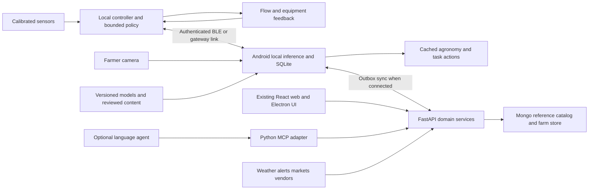
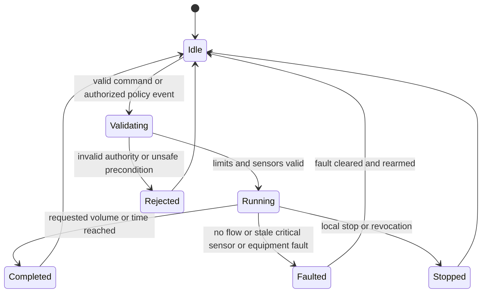

# KisanSathi implementation plan

Date: 5 September 2026
Status: proposed build plan grounded in the current repository
Requirements: [PRD](PRD.md)
Evidence and feasibility: [Research](RESEARCH.md)

## Architecture decision

Retain the React interface, FastAPI domain services, Python MCP adapter and existing Codex desktop integration. Add a deployable Android runtime for local vision/state and an independent sensor/controller node. Keep the application modular; a service per model and a database rewrite are unnecessary for the first demonstrator.

The existing FastAPI SQLite store remains the server-side synchronized farm record during the pilot. Add a device-local SQLite store on Android for offline events, approved content and read projections. This is an explicit two-store synchronization design, not an assumption that the existing server database already works offline.

For the initial pilot, designate one primary editing farmer device per farm. Secondary devices are read-only until conflict handling is implemented. Sensors and device events remain append-only. The server validates synchronization and records conflicts; it never silently replaces an observed crop stage or financial correction.



Internet loss does not break controller stop limits, local camera inference, cached guidance or record capture. The absent phone cannot provide new camera observations; continuous unattended vision needs a fixed camera/edge gateway, power budget and separate field validation.

## Ownership and repository changes

The paths marked new are proposals. They do not currently exist, and this research task does not implement them.

| Component | Existing entry point | Proposed addition/change | Responsibility |
|---|---|---|---|
| Domain contracts | backend/app/schemas, src/api | contracts/farm, contracts/device, contracts/decision, contracts/sync (new) | Versioned shared JSON schemas and compatibility fixtures |
| Farm core | backend/app/farm_state/store.py, dependencies.py | Migrations, atomic transactions, domain service extraction, sync event tables | Records and authorization |
| Agronomy | backend/app/farm_state/rules.py | backend/app/services/agronomy/ (new), reviewed crop packs | Units, stage rules, water balance and decision evidence |
| Health inference | backend/app/routers/assistants.py | models/registry/ and ml/health/ (new); provider interface | Upload contract, model metadata and review records |
| Android | None | mobile/android/ (new) | Local assets, camera, inference bridge, SQLite, BLE and sync worker |
| Frontend storage | src/api/client.js and API modules | src/data/ repository adapters (new) | Same views over HTTP or trusted local bridge |
| Device | None | firmware/controller/ and hardware/ (new) | Calibration, enrollment, telemetry, local policy and feedback |
| Agent | agent/src/kisansathi_agent/tools.py, server.py | Safe workflow tools, bounded results, intent IDs | Explanation/orchestration; no direct GPIO or shell control |
| Desktop | desktop/codex-harness.cjs | Runtime/version health, request deadline/cancellation, recovery | Optional desktop agent integration |
| Market | backend/app/scraping, services/market.py, routers/market_price.py | Latest comparable records, quote/route providers, forecast jobs | Data quality and scenario comparison |
| Tasks/economics | Existing SQLite field_tasks, browser finance | backend/app/services/tasks.py, ledger.py, inventory.py (new) | Durable actions, inventory and economics |
| Satellite | Existing farm map | backend/app/services/satellite.py (new) | Cloud-masked observations and field aggregates |
| Quality | backend/tests, agent/tests, tests/desktop, UI test | ml/evaluation, tests/contracts, tests/offline, tests/hardware (new) | Behavioral evidence and release gates |

Do not place farming rules in Codex Rust tool handlers. The application already has a Python MCP boundary. Maintain a thin provider-neutral agent interface so the farmer workflows do not depend on one language-model provider. Adding Claude later requires its own documented SDK/auth/model capability integration and evaluation; no Claude implementation currently exists in this repository.

The backend AGENTS.md still describes central-only reference data while current code already contains per-farmer storage. Resolve that documentation/architecture mismatch as an explicit first-phase decision. Any later backend changes must also update backend/ChangeLog.md, Decisions.md and Flow.md as required locally.

## Canonical data contracts

Use existing UUID-style identifiers and generate offline-safe UUIDv4 IDs for new events. Preserve existing IDs. Use RFC3339 timestamps with UTC offsets at API boundaries; store normalized UTC plus original local date when the source is date-only. A mandi arrival date is not a precise observation timestamp.

### Farm and cycle

Farm: farm_id, owner/authorized members, language, timezone, consent and export preferences.

Field: field_id, farm_id, name, confirmed GeoJSON polygon, CRS WGS84, area_m2, area_source, accuracy/uncertainty, boundary_version and active state. GeoJSON positions use longitude then latitude. Do not treat GPS boundaries as cadastral proof. Add zone_id for irrigation/soil-management zones; many fields can have multiple sensors and zones.

CropCycle: cycle_id, field_id, crop_id, variety_id when known, start/sowing/transplant date, planting method/density, previous cycle, irrigation regime, status and termination reason. Permit mixed/intercropping records through a later crop-component relation rather than forcing one unsupported label.

StageEvent: event_id, cycle_id, stage_code, observed_at, recorded_at, origin observed/reported/estimated, author, model/content version and correction link. Default stage vocabulary: land_preparation, seed_treatment, sowing, germination, vegetative, flowering, fruiting_or_grain_filling, maturity, harvest and closed. Crop packs define applicable transitions, including transplanting, failed establishment and partial harvest.

### Measurement

Every observation carries measurement, value, unit, field/zone/device, depth interval, observed_at, received_at, method, calibration_id, quality and source. Record raw values alongside normalized values when needed for audit.

| Quantity | Internal representation | Rule |
|---|---|---|
| Soil volumetric water content | m3/m3, decimal | Never confuse with arbitrary probe percentage or matric potential |
| Matric potential | kPa, signed convention documented | Separate measurement type; no universal conversion to moisture |
| Soil/air temperature | Celsius | Preserve measurement location/depth |
| Relative humidity | % from 0 to 100 | Not soil water content |
| Rain/reference ET/irrigation depth | mm for explicit interval | Cumulative versus rate distinguished |
| Flow and water volume | L/min and L | Store interval/totalizer semantics and reset identity |
| Soil EC | dS/m | Measurement/extract method and temperature compensation required |
| pH | dimensionless | Sampling/extract method required |
| Nutrients | Reported mg/kg or kg/ha with method/basis | Do not convert between them without depth/bulk density and appropriate interpretation |
| Area | m2 | Display hectares/acres via explicit conversion |
| Commodity mass | kg with fixed decimal precision | One quintal is 100 kg; retain original unit |
| Currency | INR minor-unit integers for posted money | Rates use decimal strings plus denominator; never binary-float ledger arithmetic |
| P/K basis | Explicit elemental or oxide tag | No silent P/P2O5 or K/K2O mixing |

A missing reading is null plus a reason. A reading with invalid calibration is preserved as evidence but excluded from automatic agronomic/control decisions.

### Example telemetry message

Illustrative protocol sample, not a real observation:

```json
{
  "schema_version": "1.0",
  "event_id": "60ec58ef-6c8c-4d35-922b-3e671da9d0cf",
  "device_id": "c7dfc271-39c5-49e0-96ce-fd68a452dc94",
  "boot_id": "boot-17",
  "sequence": 204,
  "field_id": "f88e08cf-0802-45fd-b3fd-2ee38d4ab03d",
  "zone_id": "zone-a",
  "observed_at": "2026-09-05T08:00:00Z",
  "clock_quality": "synchronized",
  "measurements": [
    {
      "name": "soil_vwc",
      "value": 0.23,
      "unit": "m3/m3",
      "depth_cm": 20,
      "calibration_id": "cal-2026-01",
      "quality": "valid"
    }
  ],
  "battery_percent": 76,
  "firmware_version": "controller-0.1.0"
}
```

Field/zone association is verified against device enrollment, not trusted simply because a message contains a field_id. Deduplicate by event_id and device/boot/sequence. Retain original event time; ordering by receipt time alone fails after offline buffering.

### Decision and action

Decision record: decision_id, field/cycle/zone, decision_type, created_at, valid_until, input event IDs, data freshness, model/rule/content version, options, selected recommendation, missing inputs, uncertainty, expected costs/water, explanation and allowed next actions.

Action proposal: proposal_id, decision_id, target, exact payload, payload_hash, estimated cost/resource bound, expires_at, permission_scope and status.

Authorization: authorization_id, proposal/policy ID, authenticated principal, target scope, payload or policy hash, approved limits, validity interval and revocation status.

Execution: command_id, authorization_id, target controller, issued_at, expires_at, requested duration/volume, hard maxima, expected controller/configuration version, status and evidence references.

Use an intent-specific idempotency key created when the user starts an action. Retry the same intent with the same key; a later identical purchase/record is a new intent. Commit deduplication state, mutation and outbox record in one transaction.

### New persistence entities

Add device_enrollments, calibrations, observation_quality_events, decision_records, action_proposals, authorizations, device_commands, command_events, sync_events, sync_cursors, sync_conflicts, model_versions and content_packs in D0/D1.

Add inventory_lots, inventory_movements, ledger_entries, receivables, liabilities, vendor_quotes, harvest_lots, quality_assessments and sale_options in D2. Later add certification_evidence and export_requirements.

Keep raw observations immutable. Corrections append superseding records. Ledger errors are reversed/amended with a linked audit trail. Do not overwrite historical values simply because a newer model interpreted them differently.

## IoT design

### Physical deployment

Use calibrated moisture sensors at representative root-zone depths, soil temperature, shielded air temperature/humidity and flow feedback. Add rain and tank/water-source level where the installation needs them. Choose the number and placement of probes from soil/irrigation variability; one cheap probe cannot represent every part of a farm.

An ESP32-class microcontroller is a practical prototype node. Confirm exact sensor interface, supply requirements, enclosure, cable lengths, corrosion exposure and serviceability. Wi-Fi suits reliable local coverage; BLE suits phone collection; a gateway/LoRa option is later for range. Confirm applicable radio region/hardware before procurement rather than copying a frequency from a foreign tutorial.

Use a low-voltage pump/tank or valve demonstrator for initial control testing. A real agricultural pump may have motor starting current, multiple phases and electrical protection requirements. Specify a correctly rated motor-control interface/contactor, overload/protection, isolation, manual switch and installer review. A generic consumer smart plug is not a universal pump controller. This plan intentionally does not provide mains wiring instructions.

Create a measured power budget: sensor sampling, idle current, radio duty cycle, inference duty cycle, battery reserve and charging losses. Size enclosure/weather protection and solar/battery from those measurements. A headline solar-panel wattage is not an autonomy guarantee.

### Transport

For D1, use BLE between phone and controller with authenticated enrollment; the controller owns bounded autonomous logic. If a local gateway is used, MQTT 5 is suitable for normalized telemetry and status. Design the protocol once, independent of the link.

Proposed MQTT topics: ks/v1/devices/{device_id}/telemetry, /status, /commands and /acks. Apply per-device credentials and topic access controls. Keep commands non-retained. Set expiry and use application-level command IDs even with QoS1. Retained status is permitted only with event time/expiry checks. Use TLS for network broker links and authenticated local provisioning.

Never put a model/API key on a sensor. Do not send large images through low-bandwidth telemetry. Media travels via local files or a separate authenticated upload/reference path.

### Controller state and recovery



On boot, the output defaults to a safe inactive state. An old run must not resume just because its command is replayed. Persist completed command IDs and active-run recovery state within appropriate flash-wear limits.

Use hysteresis, maximum duration/volume, minimum off-time, independent watchdog, water-source checks and flow plausibility. A local authorized policy may operate while WAN is absent if required local observations are valid. Missing/stale critical local observations require the configured conservative/manual state; never “fill in” sensor values with an LLM.

An acknowledgement means accepted/rejected, not irrigation completed. Record commanded state, measured state, flow/volume, stop reason and final result. A stop action remains locally accessible when the app, agent or broker fails.

## Local inference and knowledge delivery

### Android implementation

Build a minimal Android shell with camera, native inference, SQLite and background sync. Reuse the existing React screens where practical through a tightly scoped local bridge; load bundled content and do not expose device operations to arbitrary remote web pages. Keep camera, BLE and model execution behind typed methods.

Proposed bridge methods: captureCropImages, runLocalHealthAssessment, readFieldSnapshot, appendFarmEvent, listPendingTasks, readControllerStatus, proposeIrrigation and authorizeBoundedAction. The last method validates the local user's action/policy and does not accept arbitrary shell or network instructions.

Implement frontend DataRepository adapters for HttpRepository and AndroidRepository. Desktop/web continues to call FastAPI; Android reads local projections and queues supported writes. Do not duplicate water-budget arithmetic in React.

For parity, use one reviewed algorithm specification and shared golden fixtures across the Python service and local implementation. If dual implementations diverge, block release for that calculation. A language model should never reconcile the discrepancy silently.

### Model packaging

Each model package contains weights, checksum/signature, model_id/version, supported crop/labels, preprocessing/postprocessing settings, input shape, output schema, calibration, unknown threshold, runtime/SoC compatibility, training-data/license manifest and evaluation summary.

Download to a staging slot; verify before atomically switching the active version. Keep one prior working package and roll back after failed initialization. Record model version on every result. Do not fetch a model from an arbitrary URL provided by chat.

Image inference flow: image quality check → crop/organ validation → supported classifier or detector → calibrated result/unknown gate → contextual rule assessment → reviewed next action. Add segmentation only when severity labels justify it.

Drone imagery gets its own dataset and pipeline. Use it initially to flag suspicious areas or stand gaps for ground inspection, not as interchangeable input to a leaf classifier.

### Knowledge pack

Review crop-stage guidance with a local expert. Each entry includes crop/stage, region, conditions, evidence/source, reviewed date, effective/expiry dates, restrictions and language variants. Store label-authorized pesticide information, pre-harvest/re-entry restrictions and organic applicability when relevant. If this evidence is unavailable, the workflow asks for expert guidance instead of fabricating treatment.

Begin with SQLite text/metadata retrieval and explicit filters. Add embeddings only when evaluated retrieval quality warrants them. Do not index unreviewed web search results directly into treatment guidance.

## Agent tools and services

Preserve current safe read tools. Consolidate overlapping workflows into a smaller set of predictable operations; retain compatibility adapters rather than renaming all existing tools at once.

| Proposed capability | Service/endpoint shape | Authority |
|---|---|---|
| Assess field | GET /v1/fields/{id}/decision-context | Read; bounded source-aware snapshot |
| Create health assessment | POST /v1/health-assessments | Persist evidence/result; local model result verified/versioned |
| Plan irrigation | POST /v1/irrigation-plans | Compute options; no equipment action |
| Propose action | POST /v1/action-proposals | Persist exact proposed intent |
| Authorize action | POST /v1/action-authorizations | Authenticated app/user or preauthorized bounded policy |
| Dispatch command | POST /v1/device-commands | Controller/service credential; checks authority/version/expiry |
| Read command | GET /v1/device-commands/{id} | Read actual lifecycle and feedback |
| Sync events | POST /v1/sync/events, GET /v1/sync/changes | Scoped device; deduplicate/validate |
| Complete task | POST /v1/tasks/{id}/events | Authorized event; evidence optional/required by task |
| Compare quotes | POST /v1/procurement/comparisons | Read/calculation with dated offers |
| Compare sale options | POST /v1/sale-options/compare | Read/scenario calculation |
| Post ledger entry | POST /v1/ledger/entries | User-approved durable intent |

Endpoints above are proposed, not available APIs. Publish OpenAPI/JSON schemas and contract tests during implementation.

Agent response envelope: status, summary, structured data, source/evidence IDs, observed/issued/valid timestamps, warnings, uncertainty, proposed actions and request_id. Bound the entire serialized envelope, not just data. Use pagination/references for long history.

Use opaque media_id references bound to farmer/field and storage access controls. Avoid base64 audio/images as large conversational tool arguments. Backend SSRF/path checks apply to provider media handling; do not permit arbitrary filesystem paths supplied by the model.

Disable unrelated coding tools in the farmer runtime. Treat web/provider/vendor content as untrusted data, including instructions embedded in scraped pages. Fetch a supplier or knowledge document into an evidence structure; it must not gain authority over device control.

For local-language actions, extract critical slots into typed data and confirm the farmer's meaning before authorization. Local templates can explain decision outputs offline. Add cloud model explanation only after those data are available; do not require English translation for every manual/local interaction.

## Forecasts maps procurement and economics

Store forecasts as issued, including model/product, grid or station, issued_at, valid interval, retrieval time and ensemble member/quantile when present. Link weather to the relevant coordinates/boundary version. The immediate fix is removing unscoped latest-weather queries.

Compute historical forecast skill from archived forecasts, not historical reanalysis substituted as if it had been known in advance. Local downscaling begins only after sufficient paired observations exist. Use uncertainty by lead time. Hazard detection is local rules plus received official warnings, not an invented field-scale flood forecast.

Satellite pipeline: boundary/version → STAC query → valid acquisition → cloud/shadow masking → band/CRS handling → field/zone aggregates with valid-pixel fraction → quality check → dated trend. Reject low-coverage scenes; no synthetic interpolation labeled observation. GPS map, remotely sensed state and simulated state stay distinct.

Market pipeline: fetch raw records → validate schema/units/date → normalize crop/variety/grade/market IDs → deduplicate → retain source revision → materialize latest comparable observations → freshness policy → optional forecast job. Select observations by their actual date, not only recent download time.

Vendor pipeline: permission/source registry → discovery → identity deduplication → supplier verification → dated quote → delivered-cost comparison → selected offer/contact. Add availability, operator/fuel, minimum lot/time, refundable deposit and cancellation semantics. Supply radius and road constraints matter more than straight-line distance.

Ledger transactions connect to tasks, input lots, crop cycles and sale lots. Use explicit categories and account semantics for income, expense, transfers, debt principal, interest and capital assets. Finance forecasts are scenarios; posted entries represent actual events. Forecast profit never becomes ledger income.

## Phased build sequence

Estimates assume a six-person student team, access to one cooperating farm/expert and available target hardware. They are planning ranges, not a confirmed competition schedule. Phases overlap where dependencies allow; a field season cannot be compressed into a hackathon.

### Phase 0 contracts and scope
Estimated 2–3 working days. Owners: technical lead plus agronomy/data lead.

Confirm official PS, pilot crop/site, target SoC, supported labels and budget. Capture initial model/data licenses. Decide local/server state ownership, authorize backend architecture documentation and freeze units/action schemas.

Deliver contracts, threat/failure cases directly relevant to devices and user identity, crop pack outline, initial field protocol and hardware procurement specification.

Exit: FARM-01, CROP-01, OBS-01 and AGENT-01 contracts have fixtures; no unknown requirement blocks the first bench prototype.

### Phase 1 repair and establish the field core
Estimated 4–6 working days. Owners: backend and frontend.

Fix weather scoping, missing-soil states, unit validation, misleading confidence/eligibility labels and latest-market selection. Add migrations, atomic idempotency/outbox, authenticated farm/device identity and appropriate origin policy. Move farm calculations into tested domain services.

Add action/task lifecycle and clear stale/unsupported states in the interface. Preserve current manual routes.

Exit: regression tests show field separation, missing data, duplicate intent and date/unit behavior. Existing suites/lint/build still pass.

### Phase 2 data and health baseline
Estimated 7–12 working days, then continuous collection. Owners: ML/data and agronomy.

Collect independent local capture sessions; obtain expert labels; pin public releases; define group splits. Train MobileNetV3-Small and one comparison; train/test a supported pest detector. Begin nutrient screening with explicit uncertainty.

Deliver dataset manifest, license records, baseline report, model card, quantized export and reproducible inference fixtures.

Exit: only classes meeting the declared release gate are enabled; insufficient classes remain experimental/unsupported.

### Phase 3 sensor and controller bench
Estimated 5–8 working days, overlapping Phase 2. Owner: embedded/hardware.

Implement registry/provisioning, sampling/quality, calibration and local buffering. Build low-voltage flow-control setup. Implement bounded commands, feedback, stop/fault handling and durable deduplication.

Exit: manual stop, expired/replayed command, disconnect, reboot, no-flow, invalid sensor and maximum run cases pass with physical measurements.

### Phase 4 Android offline integration
Estimated 7–10 working days. Owners: mobile plus ML/embedded.

Bundle frontend/local store, integrate camera/native runtime, profile QNN placement and export, implement BLE transport and sync worker. Cache knowledge and language templates. Add local workflow history.

Exit: network-disabled camera → assessment → advice → authorized action → measured result → restart → eventual sync completes. No duplicate action after retries.

### Phase 5 water decisions risks and usable agent
Estimated 5–8 working days. Owners: agronomy/backend plus frontend/agent.

Implement crop-stage/root-depth-aware water balance, forecast scenarios and reviewed fallback policy. Integrate official alerts and local heat/waterlogging indicators. Route optional speech/agent workflows to shared services; validate critical slots.

Exit: rain-day-four counterexample, stale forecast, wrong field, crop-stage change, offline alert coverage and user-correction tests pass.

### Phase 6 demonstration and pilot preparation
Estimated 3–5 working days after core integration. All owners.

Freeze supported scope, model/runtime/content versions and scripted scenarios. Run small farmer usability study, full fault matrix, operating-cost estimate and reproducible demo. Prepare evidence packet and a live offline demonstration.

A core demonstrator may be achievable in roughly 4–6 calendar weeks with overlap and prompt data/hardware access. This estimate excludes a full-season impact study. If less time exists, keep one crop, one zone and one target device; defer commerce forecasts and satellite simulation.

### Phase 7 supervised farm deployment and economics
Estimated 4–8 weeks of operational iteration plus crop-dependent outcome period.

Install appropriately engineered equipment, validate calibration/placement and collect water/crop outcomes. Add inventory, durable ledger, dated vendor quotes, harvest lots, assaying and net market comparisons. Improve sync conflicts and support procedures.

Exit: evidence supports field reliability and a bounded product claim; economic recommendations use real quotes/observations.

### Phase 8 lifecycle expansion
After pilot evidence, roadmap by data readiness rather than model fashion.

Calibrate crop/rotation or yield simulation; backtest price models; add storage/grade optimization and export/organic traceability. Add FPO/shared-equipment pooling and buyer integrations. Evaluate continuous fixed-camera monitoring only with power, coverage and maintenance evidence.

## Work packages for a six-person team

| Owner | Exclusive primary responsibility | Interfaces with |
|---|---|---|
| Lead/backend | Contracts, migrations, identity, actions/sync and domain APIs | Every owner through reviewed schemas |
| Mobile/frontend | Android shell/local repository, React workflows, offline UX | ML inference bridge, embedded BLE, backend sync |
| ML/data | Dataset manifests, training/evaluation, export/model package | Agronomist labels and mobile runtime |
| Embedded | Sensors, calibration integration, firmware, controller feedback and enclosure | Mobile transport and agronomy policy |
| Agronomy/research | Crop pack, label review, water parameters, official source validity | ML/data, backend and field partner |
| Integration/QA/economics | Failure scenarios, reproducible demo, providers/quotes, ledger tests and impact records | All owners |

Keep ownership explicit when assigning coding work and preserve others' changes. Do not allow separate teams to invent incompatible field IDs, units or command states. Integration fixtures are deliverables from day one.

## Test and release evidence

| Scenario | Expected behavior | Evidence |
|---|---|---|
| Field A request with Field B newest forecast | Uses A's relevant forecast or reports unavailable | Backend regression |
| Dry root zone; rain only on day four | Does not defer past configured stress boundary | Water-model golden case |
| Missing moisture or invalid units | No confident automatic schedule | Domain and UI test |
| Yellow leaf plus ambiguous context | Possible causes/review; no invented fertilizer dose | Health-rule scenario |
| Duplicate telemetry/command after reconnect | One accepted observation/action effect | Replay test with physical output count |
| Power loss during run | Output safe on reboot; old command cannot resume blindly | Bench video and controller log |
| Pump accepted but no water flow | Fault/stop and no completed irrigation claim | Flow fault test |
| Forecast/official alert expires | Cached history distinguished from active warning | Time-controlled test |
| Unsupported crop/blurred image | Retake/unsupported outcome | Local image test set |
| Quantized model on target SoC | Accuracy gate and latency/placement measured | Model report and device trace |
| Offline record then crash/restart | Durable record; eventual single server event | Offline integration test |
| Farmer changes field/quantity after proposal | Old authorization no longer matches | Action contract test |
| Hindi/Marathi negation or unit confusion | Corrected/confirmed typed payload | Voice slot evaluation |
| Old market price downloaded today | Observation age still visible | Ingestion/ranking regression |
| Loan proceeds and later principal repayment | Neither mistaken for crop revenue/expense | Ledger accounting test |
| Store instead of sell | Loss/interest/storage and cash needs included | Scenario calculator test |

A release evidence packet should include the official brief, supported scope, architecture, data/license manifest, expert-reviewed guidance, independent test split, model metrics, target-device benchmark, calibration results, fault tests, offline demo, measured water record, cost assumptions and known limitations.

## Budget and cost model

Do not use an unverified shopping-list price as the hardware budget. Obtain at least two dated local quotes for the actual specification.

Budget categories: farmer phone or dedicated edge device; controller; calibrated moisture probes; temperature/humidity protection; flow and source-level sensing; rated pump interface; power/backup; enclosure/cables; installation; calibration/reference tests; replacement stock; connectivity; API use; expert time.

Estimate monthly cloud cost from measured usage:
farms × turns per farm × input/output tokens × provider rates,
plus speech duration/characters, map requests, weather/market calls, storage and support.
Use provider rate cards applicable to the account; no API purchase or paid job was made during this research.

Measure energy at the device and state the operating duty cycle. Price an optional fixed edge camera separately. Show both a bench demonstrator cost and an installed farm cost when presenting SIH economics.

## Definition of done

D1 is done when the declared local crop-health and water workflow works on the actual device without WAN, produces honest unknown/stale states, enforces action limits, records physical feedback and survives the failure matrix. Passing existing web tests alone is insufficient.

D2 is done when supervised farm deployment demonstrates reliability, user understanding and data integrity, and the team can report observed outcomes with their limitations. A seasonal income/yield benefit remains a hypothesis until measured over an appropriate period.

D3 is a product roadmap, not a prerequisite for a credible SIH demonstration. Add capabilities when data, provider access and field evidence justify them.
